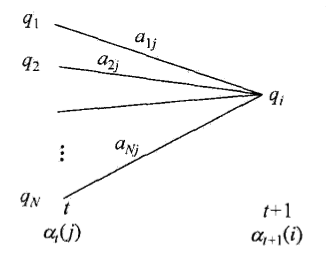
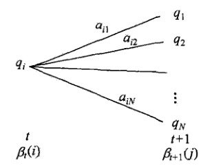

# 隐马尔可夫模型

[TOC]

> 隐马尔可夫模型（hidden Markov model，HMM）是用于标注问题的统计学习模型，描述由隐藏的马尔可夫链随机生成观测序列的过程，属于生成模型

## 10.1 隐马尔可夫模型的基本概念

### 10.1.1 隐马尔可夫模型的定义

- **定义**：隐马尔可夫模型是关于<u>*时序*</u>的概率模型，描述由一个隐藏的马尔科夫链随机生成不可观测的状态随机序列，再由各个状态生成一个观测而产生观测随机序列的过程。隐藏的马尔可夫链随机生成的状态的序列称为**状态序列**（state sequence）；每个状态生成一个观测，而由此产生的观测的随机序列称为**观测序列**（observation sequence）。序列的每一个位置又可以看作是<u>*一个时刻*</u>；
- 隐马尔可夫模型由<u>*初始概率分布*</u>、<u>*状态转移概率分布*</u>以及<u>*观测概率分布*</u>确定；

- **模型形式**：

  - 设$Q=\{q_1,\dots,q_N\}$是所有可能的状态的集合，$V=\{v_1,\dots,v_M\}]$是所有可能的观测的集合；

  - $I=(i_1,i_2,\dots,i_T)​$是长度为$T​$的状态序列，$O=(o_1,i_2,\dots,i_T)​$是对应的观测序列；

  - $A$是状态转移概率矩阵：
    $$
    A=\left[a_{ij}\right]_{N\times N}
    $$
    其中$a_{ij}=P(i_{t+1}=q_j|i_t=q_i), i=1,2,\dots,N; j=1,2,\dots,N$是在时刻$t$处于状态$q_i$的条件下，在时刻$t+1$转移到状态$q_j$的概率；

  - $B​$是观测概率矩阵：
    $$
    B=\left[b_{j}(k)\right]_{N\times M}
    $$
    其中$b_{j}(k)=P(o_t=v_k|i_t=q_j), k=1,2,\dots,M;j=1,2,\dots,N​$是在时刻$t​$处于状态$q_i​$的条件下，生成观测$v_k​$的概率；

  - $\pi$是初始状态概率向量：
    $$
    \pi=(\pi_i)
    $$
    其中$\pi_i=P(i_1=q_i), i=1,2,\dots,N$是时刻$t=1$处于状态$q_i$的概率；

- 隐马尔可夫模型由初始状态概率向量$\pi$、状态转移概率矩阵$A$以及观测概率矩阵$B$决定；$\pi$和$A$决定状态序列，$B$决定观测序列，因此隐马尔可夫模型$\lambda$可以用三元符号表示

$$
\lambda=(A,B,\pi)
$$

- 隐马尔可夫模型做了两个基本假设：

  1. **齐次马尔可夫性假设**，即假设隐藏的马尔可夫链在任意时刻$t$的状态只依赖于其前一时刻的状态，与其他时刻的状态及观测无关，也与时刻$t$无关：
     $$
     P(i_t|i_{t-1},o_{t-1},\dots,i_1,o_1)=P(i_t|i_{t-1}), \quad t=1,2,\dots,T
     $$

  2. **观测独立性假设**，即假设任意时刻的观测只依赖于该时刻的马尔可夫链的状态，与其他观测及状态无关：
     $$
     P(o_t|i_T,o_T,i_{T-1},o_{T-1},\dots,i_{t+1},o_{t+1},i_{t-1},o_{t-1},\dots,i_1,o_1)=P(o_t|i_t)
     $$

- 隐马尔可夫模型可以用于标注，这是状态对应着标记（标注问题是给定观测序列去预测其对应的标记序列）；

### 10.1.2 观测序列的生成过程

- **观测序列生成算法**：
  1. **输入**隐马尔可夫模型$\lambda=(A,B,\pi)​$，观测序列长度$T​$；
  2. 按照初始状态分布$\pi​$产生状态$i_1​$，令$t=1​$；
  3. 按照状态$i_t$的观测概率分布$b_{i_t}(k)$生成$o_{t}$；
  4. 按照状态$i_t$的状态转移概率分布$\{a_{i_t i_{t+1}}\}$产生状态$i_{t+1}\in Q$；
  5. 令$t=t+1$，如果$t<T$，转到步骤（3），否则终止；

### 10.1.3 隐马尔可夫模型的3个基本问题

1. 概率计算问题：给定模型$\lambda=(A,B,\pi)​$和观测序列$O=(o_1,i_2,\dots,i_T)​$，计算在次模型下观测序列出现的概率$P(O|\lambda)​$；
2. 学习问题：已知观测序列$O=(o_1,i_2,\dots,i_T)​$，估计模型$\lambda=(A,B,\pi)​$参数，使得在该模型下观测序列概率$P(O|\lambda)​$最大，即用极大似然估计法估计参数；
3. 预测问题，也叫**解码问题**（decoding）：已知模型$\lambda=(A,B,\pi)​$和观测序列$O=(o_1,i_2,\dots,i_T)​$，求对给定观测序列条件概率$P(I|O)​$最大的状态序列$I=(i_1,i_2,\dots,i_T)​$，即给定观测序列，求最有可能的对应的状态序列；

## 10.2 概率计算问题

### 10.2.1 直接计算法

- 直接计算法是通过列举所有可能的长度为$T​$的状态序列$I=(i_1,i_2,\dots,i_T)​$，求各个状态序列与观测序列的联合概率$P(O,I|\lambda)​$，然后对所有可能的状态序列求和得到$P(O|\lambda)​$；
- 状态序列$I=(i_1,i_2,\dots,i_T)​$的概率是

$$
P(I|\lambda)=\pi_{i_1}a_{i_1i_2}a_{i_1i_3}\cdots a_{i_{T-1}i_T}
$$

- 对于给定$I=(i_1,i_2,\dots,i_T)$，观测序列$O=(o_1,i_2,\dots,i_T)$的概率是

$$
P(O|I,\lambda)=b_{i_1}(o_1)b_{i_2}(o_2)\cdots b_{i_T}(o_T)
$$

- $I$与$O$的联合概率

$$
\begin{aligned}
P(O,I|\lambda)&=P(O|I,\lambda)P(I|\lambda) \\
&=\pi_{i_1} b_{i_1}(o_1) a_{i_1i_2} b_{i_2}(o_2) \cdots a_{i_{T-1}i_T} b_{i_T}(o_T)
\end{aligned}
$$

- 对所有可能状态序列求和，得到

$$
\begin{aligned}
P(O|\lambda)&=\sum_{I}P(O|I,\lambda)P(I|\lambda) \\
&=\sum_{i_1,i_2,\dots,i_T}\pi_{i_1} b_{i_1}(o_1) a_{i_1i_2} b_{i_2}(o_2) \cdots a_{i_{T-1}i_T} b_{i_T}(o_T)
\end{aligned}
$$

- 此方法计算量大，计算复杂度为$O(TN^T)$；

### 10.2.2 前向算法

- **前向概率**：给定隐马尔科夫模型$\lambda​$，定义到时刻$t​$部分观测序列为$o_1,o_2,\dots,o_t​$且状态为$q_i​$的概率为前向概率

$$
\alpha_t(i)=P(o_1,o_2,\dots,o_t,i_t=q_i|\lambda)
$$

​	可以递推地求得前向概率$\alpha_t(i)​$及观测序列概率$P(O|\lambda)​$；

- **观测序列概率的前向算法**：

  1. **输入**隐马尔可夫模型$\lambda​$，观测序列$O​$；

  2. 初值：$\alpha_1(i)=\pi_ib_i(o_1), \quad i=1,2,\dots,N​$；

  3. 递推，对于$t=1,2,\dots,T-1​$
     $$
     \alpha_{t+1}(i)=\left[\sum_{j=1}^{N}\alpha_t(j)a_{ji}\right]b_i(o_{t+1})
     $$

  4. 终止：
     $$
     P(O|\lambda)=\sum_{i=1}^{N}\alpha_T(i)
     $$

- 算法解释：

  1. 初始化前向概率，是初始时刻的状态$i_1=q_i$和观测$o_1$的<u>*联合概率*</u>；

  2. 递推公式中，计算到时刻$t+1​$部分观测序列为$o_1,o_2,\dots,o_t,o_{t+1}​$且在时刻$t+1​$处于状态$q_i​$的<u>*前向概率*</u>；

     

  3. 既然$\alpha_t(j)$是到时刻$t$观测到$o_1,o_2,\dots,o_t$，且在时刻$t$处于状态$q_j$的<u>*前向概率*</u>，那么乘积$\alpha_t(j)a_{ji}$就是到时刻$t$观测到$o_1,o_2,\dots,o_t$，且在时刻$t$处于状态$q_j$，而在时刻$t+1$到达状态$q_i$的<u>*联合概率*</u>；

  4. 进一步对这个乘积在时刻$t​$的所有可能的$N​$个状态求和，结果就是时刻$t​$观测到$o_1,o_2,\dots,o_t​$，并在时刻$t+1​$处于状态$q_i​$的<u>*联合概率*</u>；

  5. 上述求和的值与观测概率$b_i(o_{t+1})$的乘积恰好就是到时刻$t+1$观测到$o_1,o_2,\dots,o_t,o_{t+1}$并在时刻$t+1$处于状态$q_i$的<u>*前向概率*</u>；

  6. 最后一步中，因为$\alpha_T(i)=P(o_1,o_2,\dots,o_T,i_T=q_i|\lambda)$，所以得出$P(O|\lambda)=\sum_{i=1}^{N}\alpha_T(i)$；

- 前向算法实际是基于“状态序列的路径结构”递推计算的算法，关键在于其<u>*局部计算前向概率*</u>，然后利用路径结构将前向概率递推到全局；

- 减少计算量的原因在于每一次计算直接引用前一个时刻的计算结果，避免重复，因此其计算复杂度为$O(N^2T)$；

### 10.2.3 后向算法

- **后向概率**：给定隐马尔科夫模型$\lambda​$，定义在时刻$t​$状态为$q_i​$的条件下，观测序列$o_{t+1},o_{t+2},\dots,o_T​$的概率为后向概率

$$
\beta_t(i)=P(o_{t+1},o_{t+2},\dots,o_T|i_t=q_i,\lambda)
$$

​	可以用递推的方法求得后向概率$\beta_t(i)​$及观测序列概率$P(O|\lambda)​$；

- **观测序列概率的后向算法**：

  1. **输入**隐马尔可夫模型$\lambda​$，观测序列$O​$；

  2. 初值：$\beta_T(i)=1, \quad i=1,2,\dots,N​$；

  3. 递推，对于$t=T-1,T-2,\dots,1$
     $$
     \beta_t(i)=\sum_{j=1}^{N}a_{ij}b_j(o_{t+1})\beta_{t+1}(j), i=1,2,\dots,N
     $$

  4. 终止
     $$
     P(O|\lambda)=\sum_{i=1}^{N}\pi_ib_i(o_1)\beta_1(i)
     $$

- 算法解释：

  1. 初始化后向概率，对最终时刻的所有状态$q_i$规定$\beta_T(i)=1$；

  2. 递推公式中，为了计算在时刻$t$状态为$q_i$条件下时刻$t+1$之后的观测序列为$o_{t+1},o_{t+2},\dots,o_T$的后向概率$\beta_t(i)$，只需考虑在时刻$t+1$所有可能的$N$个状态$q_j$的转移概率（即$a_{ij}$），以及在此状态下的观测$o_{t+1}$的观测概率（即$b_j(o_{t+1})$），然后考虑状态$q_j$之后的观测序列的后向概率（即$\beta_{t+1}(j)​$）；

     

  3. 求$P(O|\lambda)​$的思路类似，只是把初始概率$\pi_i​$替代转移概率；

- 利用前向概率与后向概率的定义可以将观测序列概率统一写成

$$
P(O|\lambda)=\sum_{i=1}^{N}\sum_{j=1}^{N}\alpha_t(i)a_{ij}b_j(o_{t+1})\beta_{t+1}(j), \quad t=1,2,\dots,T-1
$$

​	当$t=1$时对于后向概率，当$t=T-1$时对应前向概率；

### 10.2.4 一些概率与期望值的计算

1. 给定模型模型$\lambda​$，观测序列$O​$，在时刻$t​$处于状态$q_i​$的概率，记作

$$
\gamma_t(i)=P(i_t=q_i|O,\lambda)
$$

​	可以通过前向后向概率计算，即
$$
\gamma_t(i)=P(i_t=q_i|O,\lambda)=\frac{P(i_t=q_i,O|\lambda)}{P(O|\lambda)}
$$
​	由前向概率$\alpha_t(i)$和后向概率$\beta_t(i)$定义可知
$$
\alpha_t(i)\beta_t(i)=P(i_t=q_i,O|\lambda)
$$
​	因此可以得到
$$
\gamma_t(i)=\frac{P(i_t=q_i,O|\lambda)}{P(O|\lambda)}=\frac{\alpha_t(i)\beta_t(i)}{\sum_{j=1}^{N}\alpha_t(j)\beta_t(j)}
$$

2. 给定模型模型$\lambda​$，观测序列$O​$，在时刻$t​$处于状态$q_i​$且在时刻$t+1​$处于状态$q_j​$的概率记为

$$
\xi_t(i,j)=P(i_t=q_i,i_{t+1}=q_j|O,\lambda)
$$

​	可以通过前向后向概率计算
$$
\xi_t(i,j)=\frac{P(i_t=q_i,i_{t+1}=q_j,O|\lambda)}{P(O|\lambda)}=\frac{P(i_t=q_i,i_{t+1}=q_j,O|\lambda)}{\sum_{i=1}^{N}\sum_{j=1}^{N}P(i_t=q_i,i_{t+1}=q_j,O|\lambda)}
$$
​	而
$$
P(i_t=q_i,i_{t+1}=q_j,O|\lambda)=\alpha_t(i)a_{ij}b_j(o_{t+1})\beta_{t+1}(j)
$$
​	因此
$$
\xi_t(i,j)=\frac{\alpha_t(i)a_{ij}b_j(o_{t+1})\beta_{t+1}(j)}{\sum_{i=1}^{N}\sum_{j=1}^{N}\alpha_t(i)a_{ij}b_j(o_{t+1})\beta_{t+1}(j)}
$$

3. 将$\gamma_t(i)$和$\xi_t(i,j)$对各个时刻求和，可以得到一些有用的期望值

   - 在观测序列$O$下状态$i$出现的期望值
     $$
     \sum_{t=1}^{T}\gamma_t(i)
     $$

   - 在观测序列$O$下由状态$i$转移的期望值
     $$
     \sum_{t=1}^{T-1}\gamma_t(i)
     $$

   - 在观测序列$O$下由状态$i$转移到状态$j$的期望值
     $$
     \sum_{t=1}^{T-1}\xi_t(i,j)
     $$

## 10.3 学习算法

> 根据训练数据是包括观测序列和对应的状态序列还是只有观测序列，可以分别由监督学习与非监督学习实现（Baum-Welsh算法，即EM算法）

### 10.3.1 监督学习方法

- 假设已给训练数据包含$S$个长度相同的观测序列和对应的状态序列$\{(O_1,I_1),\cdots,(O_S,I_S)\}$，那么可以用极大似然估计法来估计隐马尔可夫模型的参数：

  1. 转移概率$a_{ij}$估计，设样本中前一个时刻处于状态$i$到下一个时刻转移到状态$j$的频数为$A_{ij}$，那么状态转移概率的估计是
     $$
     \hat{a}_{ij}=\frac{A_{ij}}{\sum_{j=1}^{N}A_{ij}}
     $$

  2. 观测概率$b_j(k)​$估计，设样本中状态为$j​$并且观测为$k​$频数为$B_{jk}​$，那么观测概率估计是
     $$
     \hat{b}_j(k)=\frac{B_{jk}}{\sum_{k=1}^{M}B_{jk}}
     $$

  3. 初始状态概率$\pi_i$的估计为$S$个样本中初始状态为$q_i$的频率；

### 10.3.2 Baum-Welsh算法

- 假设给定训练数据包含$S$个长度为$T$的观测序列$\{O_1,\cdots,O_S\}$，没有对应的状态序列，目标是学习隐马尔可夫模型$\lambda=(A,B,\pi)$的参数；
- 将观测序列看作是观测数据$O$，状态序列看作不可观测的隐数据$I$，那么隐马尔可夫模型实际上是一个含有隐变量的概率模型：

$$
P(O|\lambda)=\sum_{I}P(O|I,\lambda)P(I|\lambda)
$$

​	可以通过EM算法实现；

1. 确实完全数据的对数似然函数，所有观测数据写成$O=(o_1,o_2,\dots,o_T)​$，所有隐数据写成$I=(i_1,i_2,\dots,i_T)​$，则完全数据是$(O,I)=(o_1,o_2,\dots,o_T,i_1,i_2,\dots,i_T)​$，其对数似然函数是

$$
\log P(O,I|\lambda)
$$

2. E步，求$Q​$函数$Q(\lambda,\tilde{\lambda})​$

$$
\begin{aligned}
Q(\lambda,\tilde{\lambda})&=\sum_{I}\log P(O,I|\lambda)P(I|O,\lambda) \\
& = \sum_{I}\log P(O,I|\lambda)\frac{P(I,O|\tilde{\lambda})}{P(O|\tilde{\lambda})} \\
& = \sum_{I}\log P(O,I|\lambda)P(I,O|\tilde{\lambda})
\end{aligned}
$$

​	省去了常数因子$1/P(O|\tilde{\lambda})$，其中$\tilde{\lambda}$hi是模型参数的当前估计值，目标是得到极大化的参数；
$$
P(O,I|\lambda)=\pi_{i_1}b_{i_1}(o_1)a_{i_1i_2}b_{i_2}(o_2)\cdots a_{i_{T-1}i_T}b_{i_T}(o_T)
$$
​	因此函数$Q(\lambda,\tilde{\lambda})​$可以写成
$$
\begin{aligned}
Q(\lambda,\tilde{\lambda})=& \sum_{I}\log\pi_{i_1}P(I,O|\tilde{\lambda}) +\sum_{I}\left(\sum_{t=1}^{T-1}\log a_{i_ti_{t+1}}\right)P(I,O|\tilde{\lambda})\\
&+\sum_{I}\left(\sum_{t=1}^{T}\log b_{i_t}(o_t)\right)P(I,O|\tilde{\lambda})\\
\end{aligned}
$$
​	式中求和都是对所有训练数据的序列总长度$T$进行；

3. M步，极大化$Q(\lambda,\tilde{\lambda})$函数求模型参数

   由于要极大化的参数单独地出现在3个项中，所以只需要对各个项极大化即可：

   1. 第一项可以写成
      $$
      \sum_{I}\log\pi_{i_1}P(I,O|\tilde{\lambda}) =\sum_{i=1}^{N}\log \pi_iP(O,i_1=i|\tilde{\lambda})
      $$
      其中$\pi_i​$满足约束条件$\sum_{i=1}^{N}\pi_i=1​$，利用拉格朗日乘子法，得到拉格朗日函数
      $$
      \sum_{i=1}^{N}\log \pi_iP(O,i_1=i|\tilde{\lambda})+\gamma\left(\sum_{i=1}^{N}\pi_i=1\right)
      $$
      对其求偏导并令为0
      $$
      \frac{\partial}{\partial \pi_i}\left[\sum_{i=1}^{N}\log \pi_iP(O,i_1=i|\tilde{\lambda})+\gamma\left(\sum_{i=1}^{N}\pi_i=1\right)\right]=0
      $$
      得到
      $$
      P(O,i_1=i|\tilde{\lambda}) + \gamma  \pi_i=0
      $$
      对$i$求和得到
      $$
      \gamma=-P(O|\tilde{\lambda})
      $$
      因此代入可得
      $$
      \pi_i=\frac{P(O,i_1=i|\tilde{\lambda})}{P(O|\tilde{\lambda})}
      $$

   2. 第二项可以写成
      $$
      \sum_{I}\left(\sum_{t=1}^{T-1}\log a_{i_ti_{t+1}}\right)P(I,O|\tilde{\lambda})=\sum_{i=1}^{N}\sum_{j=1}^{N}\sum_{t=1}^{T-1}\log a_{ij}P(O,i_t=i,i_{t+1}=j|\tilde{\lambda})
      $$
      类似第一项，通过构造拉格朗日函数，约束条件是$\sum_{j=1}^{N}a_{ij}=1$，可以求得
      $$
      a_{ij}=\frac{\sum_{t=1}^{T-1}P(O,i_t=i,i_{t+1}=j|\tilde{\lambda})}{\sum_{t=1}^{T-1}P(O,i_t=i|\tilde{\lambda})}
      $$

   3. 第三项写成
      $$
      \sum_{I}\left(\sum_{t=1}^{T}\log b_{i_t}(o_t)\right)P(I,O|\tilde{\lambda})=\sum_{j=1}^{N}\sum_{t=1}^{T}\log b_{j}(o_t)P(O,i_t=j|\tilde{\lambda})
      $$
      同样用拉格朗日乘子法，约束条件是$\sum_{k=1}^{M}b_j(k)=1​$，注意只有在$o_t=v_k​$时$b_j(o_t)​$对$b_j(k)​$的偏导数才不为0，以$I(o_t=v_k)​$表示
      $$
      b_j(k)=\frac{\sum_{t=1}^{T}P(O,i_t=j|\tilde{\lambda})I(o_t=v_k)}{\sum_{t=1}^{T}P(O,i_t=j|\tilde{\lambda})}
      $$
      

### 10.3.3 Baum-Welsh模型参数估计公式

- 将上述M步的各个概率用$\gamma_t(i)$和$\xi_t(i,j)$表示，可以写成

$$
\begin{aligned}
a_{ij}&=\frac{\sum_{t=1}^{T-1}\xi_t(i,j)}{\sum_{t=1}^{T-1}\gamma_t(i)} \\
b_j(k)&=\frac{\sum_{t=1,o_t=v_k}^{T}\gamma_t(j)}{\sum_{t=1}^{T}\gamma_t(j)} \\
\pi_i&=\gamma_1(i)
\end{aligned}
$$

​	以上就是Baum-Welsh算法，是EM算法在隐马尔可夫模型学习中的具体实现；

- **Baum-Welsh算法**：
  1. **输入**观测数据$O=(o_1,o_2,\dots,o_T)​$；
  2. 初始化：对$n=0​$，选取$a_{ij}^{(0)},b_j(k)^{(0)},\pi_i^{(0)}​$得到模型$\lambda^{(0)}=(A^{(0)},B^{(0)},\pi^{(0)})​$；
  3. 递推，对于$n=1,2,\dots​$，使用上述式子更新模型参数；
  4. **输出**最终模型参数$\lambda^{(n+1)}=(A^{(n+1)},B^{(n+1)},\pi^{(n+1)})$；

## 10.4 预测算法

### 10.4.1 近似算法

- **思想**：在每个时刻$t​$选择在该时刻最有可能出现的状态$i_t^*​$，从而得到一个状态序列$I^*=(i_1^*,\dots,i_T^*)​$将其作为预测的结果；
- 给定隐马尔可夫模型$\lambda$和观测序列$O$，在时刻$t$处于状态$q_i$的概率是

$$
\gamma_t(i)=\frac{P(i_t=q_i,O|\lambda)}{P(O|\lambda)}=\frac{\alpha_t(i)\beta_t(i)}{\sum_{j=1}^{N}\alpha_t(j)\beta_t(j)}
$$

- 在每一时刻$t$最有可能的状态是

$$
i_t^*=\arg\max\limits_{1\leq i\leq N}[\gamma_t(i)], \quad t=1,2,\dots,T
$$

- 算法的优点是计算简单，但是缺点是不能保证预测的状态序列<u>*整体是最有可能的*</u>，因为预测的状态序列可能有实际不发生的部分；
- 上述方法的得到的状态序列中有可能存在<u>*转移概率为0*</u>的相邻状态；

### 10.4.2 维特比算法

- **维特比算法**（Viterbi algorithm）：利用<u>*动态规划*</u>（dynamic programming）解隐马尔可夫模型预测问题，求概率最大路径（最优路径），这条路径对应一个状态序列；

- 动态规划得到的最优路径的特性：如果最优路径在时刻$t$通过结点$i_t^*$，那么这一路径从结点$i_t^*$到终点$i_T^*$的部分路径，对于从从$i_t^*$到$i_T^*$的所有可能的部分路径来说，也是最优的；
- 因此只需从时刻$t=1$开始，递推地计算在时刻$t$状态为$i$的各条部分路径的最大概率，直到得到时刻$t=T$状态为$i$的各条部分路径的最大概率，即为最优路径的概率$P^*$，最优路径的终结点$i_T^*$也同时得到；
- 为了找出最优路径的各个结点，从终结点开始，由后向前逐步求得，得到最优路径；

- 定义在时刻$t​$状态为$i​$的所有单个路径$(i_1,i_2,\dots,i_t)​$中概率最大值为：

$$
\delta_t(i)=\max\limits_{i_1,i_2,\dots,i_{t-1}}P(i_t=i,i_{t-1},\dots,i_1,o_t,\dots,o_1|\lambda), \quad i=1,2,\dots,N
$$

- 由此可得变量$\delta$的递推公式为

$$
\begin{aligned}
\delta_{t+1}(i)&=\max\limits_{i_1,i_2,\dots,i_{t}}P(i_{t+1}=i,i_{t},\dots,i_1,o_{t+1},\dots,o_1|\lambda) \\ 
&=\max\limits_{1\leq j\leq N}[\delta_t(j)a_{ji}]b_t(o_{t+1}) \quad i=1,2,\dots,N; t=1,2,\dots,T-1
\end{aligned}
$$

- 定义在时刻$t$状态为$i$的所有单个路径$(i_1,i_2,\dots,i_t)$中概率最大的路径的第$t-1$个结点为：

$$
\psi_t(i)=\arg\max\limits_{1\leq j\leq N}[\delta_{t-1}(j)a_{ji}], \quad i=1,2,\dots,N
$$

- **维特比算法**：

  1. **输入**模型$\lambda=(A,B,\pi)$和观测数据$O=(o_1,o_2,\dots,o_T)$；

  2. 初始化：
     $$
     \begin{aligned}
     \delta_1(i)=\pi_ib_i(o_1), \quad i=1,2,\dots,N \\
     \psi_1(i) = 0, \quad i=1,2,\dots,N
     \end{aligned}
     $$

  3. 递推，对于$t=2,3,\dots,T$
     $$
     \begin{aligned}
     \delta_{t}(i)=\max\limits_{1\leq j\leq N}[\delta_{t-1}(j)a_{ji}]b_t(o_{t}) \quad i=1,2,\dots,N\\
     \psi_t(i)=\arg\max\limits_{1\leq j\leq N}[\delta_{t-1}(j)a_{ji}], \quad i=1,2,\dots,N \\
     \end{aligned}
     $$

  4. 终止
     $$
     P^*=\max\limits_{1\leq i\leq N}\delta_T(i) \\
     i_T^*=\arg\max\limits_{1\leq i\leq N}[\delta_T(i)]
     $$

  5. 最优路径回溯，对于$t=T-1,T-2,\dots,1$
     $$
     i_t^*=\psi_{t+1}(i_{t+1}^*)
     $$
     求得最优路径$I^*=(i_1^*,\dots,i_T^*)$；

