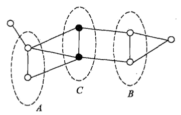

# 条件随机场

[TOC]

> - **条件随机场**（conditional random field，CRF）是给定一组输入随机变量条件下，另一组输出随机变量的条件概率分布模型；
> - 特点是假设输出随机变量构成**马尔可夫随机场**；
> - 条件随机场可以用于不同的预测问题，本章讨论在标注问题的应用，即**线性链**（linear chain）条件随机场；
> - 上述问题变成由输入序列对输出序列预测的<u>*判别模型*</u>，形式为**对数线性模型**，学习方法是极大似然估计或正则化的极大似然估计；

## 11.1 概率无向图模型

> **概率无向图模型**（probabilistic undirected graphical model）又称为**马尔可夫随机场**（Markov random field），是一个可以由无向图表示的<u>*联合概率分布*</u>

### 11.1.1 模型定义

- **图**（graph）是由结点（node）和连接结点的边（edge）组成的集合，结点和边分布记作$v$和$e$，因此集合分别记作$V$和$E$，图记作$G=(V,E)$；
- **概率图模型**（probabilistic graphical model）是由图表示的概率分布，设有联合概率分布$P(Y)$，$Y\in \mathcal{Y}$是一组随机变量，由无向图$G=(V,E)$表示概率分布$P(Y)$，即在图$G$中，结点$v\in V$表示一个随机变量$Y_v$，$Y=(Y_v)_{v\in V}$；边$e\in E$表示随机变量之间的概率依赖关系；
- 给定一个联合概率分布$P(Y)$，和表示它的无向图$G$，定义无向图表示的随机变量之间可能存在的属性：
    - **成对马尔可夫性**（pairwise Markov property）：设$u$和$v$是无向图中任意两个没有边连接的结点，分别对应随机变量$Y_u$和$Y_v$，其他所有结点为$O$，对应随机变量组是$Y_O$；成对马尔可夫性是指给定随机变量组$Y_O$的条件下，随机变量$Y_u$和$Y_v$是条件独立的，即
    $$
    P(Y_u,Y_v|Y_O)=P(Y_u|Y_O)P(Y_v|Y_O)
    $$
    - **局部马尔可夫性**（local Markov property）：设$v\in V$是无向图中任意一个结点，对应随机变量$Y_v$，$W$是与$v$有边连接的所有结点，对应随机变量组是$Y_W$，$O$是$v,W$以外的其他所有结点，对应随机变量组是$Y_O$；局部马尔可夫性是指在给定随机变量组$Y_W$的条件下随机变量$Y_v$与随机变量组$Y_O$是独立的，即
    $$
    P(Y_v,Y_O|Y_W)=P(Y_v|Y_W)P(Y_O|Y_W)
    $$
    在$P(Y_O|Y_W)>0$时，等价地
    $$
    P(Y_v|Y_W)=P(Y_v|Y_W,Y_O)
    $$
    
    - **全局马尔可夫性**（global Markov property）：设结点集合$A,B$是在无向图$G$中被结点集合$C$分开的任意结点集合，分别对应的随机变量组是$Y_A,Y_B,Y_C$；全局马尔可夫性是指给定随机变量组$Y_C$条件下，随机变量组$Y_A$和$Y_B$是条件独立的，即
    $$
    P(Y_A,Y_B|Y_C)=P(Y_A|Y_C)P(Y_B|Y_C)
    $$
    

    - 上述三个定义是等价的；

- **概率无向图模型**定义：设有联合概率分布$P(Y)$，由无向图$G=(V,E)$表示，在图$G$中，结点表示随机变量，边表示随机变量之间的依赖关系；如果联合概率分布$P(Y)​$满足<u>*成对、局部或全局马尔可夫性*</u>，就称此联合概率分布为概率无向图模型，或马尔可夫随机场；

- 更加关注的问题是如何求其联合概率分布，如果可以将整体的联合概率写成若干子联合概率乘积的形式，就便于模型的学习与计算；

### 11.1.2 概率无向图模型的因子分解

- **团与最大团**：无向图$G$中任何两个结点均有边连接的结点集称为团（clique），若$C$是无向图的一个团，并且不能再加进任何一个$G$的结点使其成为一个更大的团，则称$C$为最大团（maximal clique）；
- **概率无向图模型的因子分解**（factorization）：将概率无向图模型的联合概率分布表示为其最大团上的随机变量的函数的乘积形式的操作；
- 给定概率无向图模型及其无向图$G$，$C$为$G$上的最大团，对应的随机变量组是$Y_C$，那么概率无向图模型的联合概率分布$P(Y)$可写作图中所有最大团$C$上的函数$\Psi_C(Y_C)$的乘积的形式，即
$$
P(Y)=\frac{1}{Z}\prod_{C}\Psi_C(Y_C)
$$
​	其中$Z$是归一化因子（normalization factor），保证$P(Y)$构成一个概率分布：
$$
Z=\sum_{Y}\prod_{C}\Psi_C(Y_C)
$$
​	函数$\Psi_C(Y_C)$称为**势函数**（potential function），且要求势函数是严格正的，通常定义为指数函数：
$$
\Psi_C(Y_C)=\exp \{-E(Y_C)\}
$$

- **Hammersley-Clifford定理**：概率无向图模型的联合概率分布可以表示为
$$
P(Y)=\frac{1}{Z}\prod_{C}\Psi_C(Y_C) \\
Z=\sum_{Y}\prod_{C}\Psi_C(Y_C)
$$
​	其中$C$是无向图的最大团，$\Psi_C(Y_C)$是$C$上定义的严格正函数，乘积是在无向图的所有最大团上进行；

## 11.2 条件随机场的定义与形式
### 11.2.1 条件随机场的定义
- **条件随机场**（conditional random field）是给定随机变量$X$的条件下，随机变量$Y$的马尔可夫随机场；
- **条件随机场定义**：设$X$和$Y$是随机变量，$P(Y|X)$是在给定$X$的条件下$Y$的条件概率分布，若随机变量$Y$构成一个由无向图$G=(V,E)$表示的马尔可夫随机场，则
$$
P(Y_v|X,Y_w,w \neq v)=P(Y_v|X,Y_w,w\sim v)
$$
​	对于任意结点$v$成立，则称条件概率分布$P(Y|X)$为条件随机场；其中$w\sim v$表示在图$G$中与结点$V$有边连接的所有结点$W$，$w \neq v$表示结点$V$以外的所有结点；
- 上述定义并没有要求$X$和$Y$具有相同的结构，下面主要讨论$X$和$Y$有相同的图结构，即考虑线性链的情况
$$
G=(V=(1,2,\dots,n), E={(i,i+1)}), \quad i=1,2,\dots,n-1
$$
​	此时$X=(X_1,X_2,\cdots,X_n)$，$Y=(Y_1,Y_2,\cdots,Y_n)$，最大团是相邻两个结点的集合；
- 下图分别是“线性链条件随机场”和“X和Y具有相同的图结构的线性链条件随机场”的示意图

- **线性链条件随机场**（linear chain conditional random field）可以用于标注问题，这时在条件概率模型$P(Y|X)$中，$Y$是输出变量，表示标记序列，$X$是输入变量，表示需要标注的观测序列；
- **线性链条件随机场定义**：设$X=(X_1,X_2,\cdots,X_n)$，$Y=(Y_1,Y_2,\cdots,Y_n)$均为线性链表示的随机变量序列，若在给定随机变量序列$X$的条件下，随机变量序列$Y$的条件概率分布$P(Y|X)$构成条件随机场，即满足马尔可夫性
$$
P(Y_i|X,Y_1,\cdots,Y_{i-1},Y_{i+1},\cdots,Y_{n})=P(Y_i|X,Y_{i-1},Y_{i+1}), \\
i=1,2,\dots,n (在i=1和n时只考虑单边)
$$
​	则称$P(Y|X)$为线性链条件随机场；

### 11.2.2 条件随机场的参数化形式
- **线性链条件随机场的参数化形式**定理：设$P(Y|X)$为线性链条件随机场，则在随机变量$X$取值为$x$的条件下，随机变量$Y$取值为$y$的条件概率具有如下形式
$$
P(y|x)=\frac{1}{Z(x)}\exp\left(\sum_{i,k}\lambda_kt_k(y_{i-1},y_i,x,i)+\sum_{i,l}\mu_ls_l(y_i,x,i)\right)
$$
​	其中
$$
Z(x)=\sum_{y}\exp\left(\sum_{i,k}\lambda_kt_k(y_{i-1},y_i,x,i)+\sum_{i,l}\mu_ls_l(y_i,x,i)\right)
$$
​	式中，$t_k$和$s_l$是特征函数，$\lambda_k$和$\mu_l$是对应的权重，$Z(x)$是归一化因子，求和是在所有可能输出序列上进行；
- 上式中的$t_k$是定义在边上的转移函数，称为转移特征，依赖于当前和前一个位置；$s_l$是定义在结点上的特征函数，称为状态特征，依赖于当前位置；两者都依赖于位置，是局部特征函数；
- 通常特征函数$t_k$和$s_l$取值为1（当满足特征条件时），否则为0；
- 线性链条件随机场也是**对数线性模型**（log linear model）；

### 11.2.3 条件随机场的简化形式
- 在条件随机场中，同一特征在各个位置都有定义，可以对统一特征在各个位置求和，将局部特征函数转化为一个全局的特征函数，这时条件随机场就可以写成权值向量和特征向量的内积的形式；
- 设有$K_1$个转移特征，$K_2$个状态特征，$K=K_1+K_2$，记
$$
f_k(y_{i-1},y_i,x,i)
=\left\{
\begin{aligned}
t_k(y_{i-1},y_i,x,i), &\quad k=1,2,\dots,K_1 \\
s_l(y_i,x,i), &\quad  k=K_1+l; l=1,2,\dots,K_2 
\end{aligned}
\right.
$$
- 然后对转移与状态特征在各个位置$i$求和，得到
$$
f_k(y,x)=\sum_{i=1}^{n}f_k(y_{i-1},y_i,x,i),\quad k=1,2,\dots,K
$$
- 用$w_k$表示特征$f_k(y,x)$的权值，即
$$
w_k=\left\{
\begin{aligned}
\lambda_k, &\quad k=1,2,\dots,K_1 \\
\mu_l, &\quad  k=K_1+l; l=1,2,\dots,K_2 
\end{aligned}
\right.
$$
- 因此条件随机场就可以表示为
$$
\begin{aligned}
P(y|x)&=\frac{1}{Z(x)}\exp\sum_{k=1}^{K}w_kf_k(y,x) \\
Z(x) &= \sum_{y}\exp\sum_{k=1}^{K}w_kf_k(y,x)
\end{aligned}
$$
- 若以$w$表示权值向量，即$w=(w_1,w_2,\dots,w_K)^T$，以$F(y,x)$表示全局特征向量，即$F(y,x)=(f_1(y,x),f_2(y,x),\dots,f_K(y,x))^T$，则条件随机场可以写成向量内积的形式：
$$
\begin{aligned}
P_w(y|x)&=\frac{\exp(w\cdot F(y,x))}{Z_w(x)} \\
Z_w(x) &=\sum_{y}\exp(w\cdot F(y,x)) 
\end{aligned}
$$

### 11.2.4 条件随机场的矩阵形式

- 假设$P_w(y|x)$是线性链条件随机场，表示对给定观测序列$x$，相应的标记序列$y$的条件概率，引进特殊的起点与重点状态标记$y_0=\text{start}, y_{n+1}=\text{stop}$，这时$P_w(y|x)$可以通过矩阵形式表示；
- 对观测序列$x$的每一个位置$i=1,2,\dots,n+1$，定义一个$m$阶矩阵（$m$是标记$y_i$取值的个数）
$$
\begin{aligned}
M_i(x)&=[M_i (y_{i-1},y_i|x)] \\
M_i(y_{i-1},y_i|x) &= \exp(W_i(y_{i-1},y_i|x)) \\
W_i(y_{i-1},y_i|x) & = \sum_{k=1}^{K}w_k f_k(y_{i-1},y_i,x,i)
\end{aligned}
$$
- 这样给定观测序列$x$，相应标记序列$y$的非规范化概率可以通过该序列$n+1$个矩阵适当元素的乘积$\prod_{i=1}^{n+1}M_i(y_{i-1},y_i|x)$表示，而条件概率是
$$
P_w(y|x)=\frac{1}{Z_w(x)}\prod_{i=1}^{n+1}M_i(y_{i-1},y_i|x)
$$
​	其中$Z_w(x)$是规范化因子，是$n+1$个矩阵的乘积的(start,stop)元素：
$$
Z_w(x)=(M_1(x)M_2(x)\cdots M_{n+1}(x))_{\text{start},\text{stop}}
$$
​	注意，$y_0=\text{start}$与$y_{n+1}=\text{stop}$表示开始与终止状态，规范化因子是以start为起点stop为终点通过状态的所有路径$y_1y_2\cdots y_n$的非规范化概率$\prod_{i=1}^{n+1}M_i(y_{i-1},y_i|x)$之和；

## 11.3 条件随机场的概率计算问题

> 条件随机场的概率计算问题是给定条件随机场$P(Y|X)$，输入序列$x$和输出序列$y$，计算条件概率$P(Y_i=y_i|x), P(Y_{i-1}=y_{i-1},Y_i=y_i|x)$以及相应的数学期望的问题。

### 11.3.1 前向-后向算法

> 跟隐马尔可夫模型类似，引进前向-后向算法，递归计算概率以及期望值

- 对于每个索引$i=0,1,\dots,n+1$，定义**前向向量**$\alpha_i(x)$：
$$
\alpha_0(y|x)=\left\{
\begin{aligned}
1, &\quad y=\text{start} \\
0, &\quad \text{otherwise} 
\end{aligned}
\right.
$$
​	递推公式为
$$
\alpha_i^T(y_i|x)=\alpha_{i-1}^T(y_{i-1}|x)[M_i(y_{i-1},y_i|x)], \quad i=1,2,\dots,n+1
$$
​	或写成
$$
\alpha_i^T(x)=\alpha_{i-1}^T(x)M_i
$$
​	其中$\alpha_i(y_i|x)$表示在位置$i$的标记是$y_i$并且到位置$i$的前部分标记序列的非规范化概率，$y_i$可取的值有$m$个，所以$\alpha_i(x)$是$m$维列向量；

- 同样对于对于每个索引$i=0,1,\dots,n+1$，定义**后向向量**$\beta_i(x)$：
$$
\begin{aligned}
\beta_{n+1}(y_{n+1}|x)&=\left\{
\begin{aligned}
1, &\quad y_{n+1}=\text{stop} \\
0, &\quad \text{otherwise} 
\end{aligned}
\right. \\
\beta_i(y_i|x) &= [M_i(y_i,y_{i+1}|x)]\beta_{i+1}(y_{i+1}|x)
\end{aligned}
$$
​	即
$$
\beta_i(x) = M_{i+1}(x)\beta_{i+1}(x)
$$
​	其中$\beta_i(y_i|x)$表示在位置$i$的标记为$y_i$并且从$i+1$到$n$的后部分标记序列的非规范化概率；

- 由前向-后向向量定义可以得到
$$
Z(x)=\alpha_n^T(x)\cdot \boldsymbol{1}=\boldsymbol{1}^T \cdot \beta_1(x)
$$
​	其中$\boldsymbol{1}$是元素均为1的$m$维列向量；

### 11.3.2 概率计算

- 标记序列在位置$i$是标记$y_i$的条件概率
$$
P(Y_i=y_i|x)=\frac{\alpha_i^T(y_i|x)\beta_i(y_i|x)}{Z(x)}
$$
- 标记序列在位置$i-1$和$i$分别是标记$y_{i-1}$和$y_i$的条件概率

$$
P(Y_{i-1}=y_{i-1},Y_i=y_i|x)=\frac{\alpha_{i-1}^T(y_{i-1}|x)M_i(y_{i-1},y_i|x)\beta_i(y_i|x)}{Z(x)}
$$
​	其中$Z(x)=\alpha_n^T(x)\cdot \boldsymbol{1}$；

### 11.3.3 期望值的计算

> 利用前向-后向向量，可以计算特征函数关于联合分布和条件分布的数学期望

- 特征函数$f_k$关于条件分布$P(Y|X)$的数学期望
$$
\begin{aligned}
\mathbb{E}_{P(Y|X)}[f_k]&=\sum_{y}P(y|x)f_k(y,x) \\
&=\sum_{i=1}^{n+1}\sum_{y_{i-1}y_i}f_k(y_{i-1},y_i,x,i)\frac{\alpha_{i-1}^T(y_{i-1}|x)M_i(y_{i-1},y_i|x)\beta_i(y_i|x)}{Z(x)} \\
&\quad \quad k=1,2,\dots,K
\end{aligned}
$$

- 假设经验分布为$\tilde{P}(X)$，特征函数$f_k$关于联合分布$P(X,Y)$的数学期望是
$$
\begin{aligned}
\mathbb{E}_{P(X,Y)}[f_k]&=\sum_{x,y}P(x,y)\sum_{i=1}^{n+1}f_k(y_{i-1},y_i,x,i) \\
&=\sum_{x}\tilde{P}(x)\sum_{y}P(y|x)\sum_{i=1}^{n+1}f_k(y_{i-1},y_i,x,i) \\
&=\sum_{x}\tilde{P}(x)\sum_{i=1}^{n+1}\sum_{y_{i-1}y_i}f_k(y_{i-1},y_i,x,i)\frac{\alpha_{i-1}^T(y_{i-1}|x)M_i(y_{i-1},y_i|x)\beta_i(y_i|x)}{Z(x)} \\
&\quad \quad k=1,2,\dots,K
\end{aligned}
$$

- 对于转移特征$t_k(y_{i-1},y_i,x,i),k=1,2,\dots,K_1$可以将式中$f_k$换成$t_k$；对于状态特征，可以将式中$f_k$换成$s_l$，表示为$s_l(y_i,x,i),k=K_1+l,l=1,2,\dots,K_2$;

## 11.4 条件随机场的学习算法

> 条件随机场实际上是定义在时序数据上的对数线性模型

### 11.4.1 改进的迭代尺度法

- 已知训练数据集，可知经验概率分布$\tilde{P}(X,Y)$，通过极大化训练数据的对数似然函数求模型参数；
- 对数似然函数为
$$
\begin{aligned}
L(w)&=L_{\tilde{P}}(P_w)=\log\prod_{x,y}P_w(y|x)^{\tilde{P}(x,y)}=\sum_{x,y}\tilde{P}(x,y)\log P_w(y|x) \\
& =\sum_{x,y}\left[\tilde{P}(x,y)\sum_{k=1}^{K}w_kf_k(y,x) - \tilde{P}(x,y)\log Z_w(x) \right] \\
& =\sum_{j=1}^{N}\sum_{k=1}^{K}w_kf_k(y_j,x_j) - \sum_{j=1}^{N}\log Z_w(x)\\
\end{aligned}
$$
- 改进的迭代尺度法通过迭代的方法不断优化对数似然函数改变量的下界，达到极大化对数似然函数的目的，假设模型当前参数向量$w=(w_1,\dots,w_K)^T$，向量的增量为$\delta=(\delta_1,\dots,\delta_K)^T$，更新参数向量为$w+\delta=(w_1+\delta_1,\dots,w_K+\delta_K)^T$；
- 转移特征的更新方程为
$$
\begin{aligned}
\mathbb{E}_{\tilde{P}}[t_k]&=\sum_{x,y}\tilde{P}(x,y)\sum_{i=1}^{n+1}t_k(y_{i-1},y_i,x,i) \\
&=\sum_{x,y}\tilde{P}(x)P(y|x)\sum_{i=1}^{n+1}t_k(y_{i-1},y_i,x,i)\exp(\delta_kT(x,y)) \\
&\quad \quad k=1,2,\dots,K_1
\end{aligned}
$$
- 状态特征的更新方程为
$$
\begin{aligned}
\mathbb{E}_{\tilde{P}}[s_l]&=\sum_{x,y}\tilde{P}(x,y)\sum_{i=1}^{n+1}s_l(y_i,x,i) \\
&=\sum_{x,y}\tilde{P}(x)P(y|x)\sum_{i=1}^{n}s_l(y_i,x,i)\exp(\delta_{K_1+l}T(x,y)) \\
&\quad \quad l=1,2,\dots,K_2
\end{aligned}
$$
- 其中$T(x,y)$是在数据$(x,y)$中出现所有特征数的总和：
$$
T(x,y)=\sum_{k}f_k(y,x)=\sum_{k=1}^{K}\sum_{i=1}^{n+1}f_k(y_{i-1},y_i,x,i)
$$

- **条件随机场模型学习的改进的迭代尺度法**：
    1. **输入**特征函数$t_1,\dots,t_{K_1},\quad s_1,\dots,s_{K_2}$，经验分布$\tilde{P}(x,y)$;
    2. 对于所有$k\in\{1,2,\dots,K\}$，取初值$w_k=0$；
    3. 对于每一个$k\in\{1,2,\dots,K\}$：
        1. 当$k=1,2,\dots,K_1$时，令$\delta_k$是以下方程的解
        $$
        \sum_{x,y}\tilde{P}(x)P(y|x)\sum_{i=1}^{n+1}t_k(y_{i-1},y_i,x,i)\exp(\delta_kT(x,y))=\mathbb{E}_{\tilde{P}}[t_k]
        $$
        当$k=K_1+l,l=1,2,\dots,K_2$时，令$\delta_k$是以下方程的解
        $$
        \sum_{x,y}\tilde{P}(x)P(y|x)\sum_{i=1}^{n}s_l(y_i,x,i)\exp(\delta_{K_1+l}T(x,y))=\mathbb{E}_{\tilde{P}}[s_l]
        $$
        2. 更新$w_k$的值：$w_k\leftarrow w_k+\delta_k$;
    4. 如果不是所有的$w_k$都收敛，重复步骤（3）；

- $T(x,y)$表示数据$(x,y)$中的特征总数，对不同的数据取自可能不同，为了解决这个问题，定义松弛特征
$$
s(x,y) = S-\sum_{k=1}^{K}\sum_{i=1}^{n+1}f_k(y_{i-1},y_i,x,i)
$$
​	其中$S$是一个常数，选择足够大的常数$S$使得训练数据集的所有数据，$s(x,y)\geq 0$成立，这时特征总数可取为$S$；

- 此时对于转移特征$t_k$，$\delta_k$的更新方程为
$$
\delta_k=\frac{1}{S}\log\frac{\mathbb{E}_{\tilde{P}}[t_k]}{\mathbb{E}_{P}[t_k]}
$$
​	其中$\mathbb{E}_{P}[t_k]=\sum_{x}\tilde{P}(x)\sum_{i=1}^{n+1}\sum_{y_{i-1}y_i}t_k(y_{i-1},y_i,x,i)\frac{\alpha_{i-1}^T(y_{i-1}|x)M_i(y_{i-1},y_i|x)\beta_i(y_i|x)}{Z(x)}$；
- 同理，对于状态特征$s_l$，$\delta_k$的更新方程为
$$
\delta_k=\delta_{K_1+l}=\frac{1}{S}\log\frac{\mathbb{E}_{\tilde{P}}[s_l]}{\mathbb{E}_{P}[s_l]}
$$
​	其中$\mathbb{E}_{P}[s_l]=\sum_{x}\tilde{P}(x)\sum_{i=1}^{n}\sum_{y_i}s_l(y_i,x,i)\frac{\alpha_{i}^T(y_{i}|x)\beta_i(y_i|x)}{Z(x)}$
- 以上算法成为**算法S**，需要使用常数$S$足够带，这样每一步迭代的增量向量会变大，算法收敛慢；

- **算法T**试图解决该问题，对于每个观测序列$x$计算其特征总数最大值$T(x)$：
$$
T(x)=\max\limits_{y}T(x,y)
$$
​	且利用前向-后向递推式，容易计算出$T(x)=t$；

- 转移特征参数的更新方程为：
$$
\begin{aligned}
\mathbb{E}_{\tilde{P}}[t_k]&=\sum_{x,y}\tilde{P}(x)P(y|x)\sum_{i=1}^{n+1}t_k(y_{i-1},y_i,x,i)\exp(\delta_kT(x)) \\
&=\sum_{x}\tilde{P}(x)\sum_{y}P(y|x)\sum_{i=1}^{n+1}t_k(y_{i-1},y_i,x,i)\exp(\delta_kT(x)) \\
&=\sum_{x}\tilde{P}(x)a_{k,t}\exp(\delta_k\cdot t) \\
&=\sum_{t=0}^{T_{max}}a_{k,t}\beta_k^t
\end{aligned}
$$
​	其中$a_{k,t}$是特征$t_k$的期望值，$\delta_k=\log \beta_k$，$\beta_k$是上述方程的唯一实根，可以用牛顿法求得，从而得到$\delta_k$的更新式；

- 同理，对于状态特征参数的更新方程为：
$$
\begin{aligned}
\mathbb{E}_{\tilde{P}}[s_l]&=\sum_{x,y}\tilde{P}(x)P(y|x)\sum_{i=1}^{n}s_l(y_i,x,i)\exp(\delta_{K_1+l}T(x,y)) \\
&=\sum_{t=0}^{T_{max}}b_{l,t}\gamma_l^t
\end{aligned}
$$
​	其中$b_{l,t}$是特征$s_l$的期望值，$\delta_l=\log \gamma_l$，$\gamma_l$是上述方程的唯一实根，也可以用牛顿法求得；

### 11.4.2 拟牛顿法

- 对于条件随机场模型
$$
P_w(y|x)=\frac{\exp(\sum_{k=1}^{K}w_kf_k(y,x))}{\sum_{y}\exp(\sum_{k=1}^{K}w_kf_k(y,x))}
$$
​	学习的优化目标函数是
$$
\begin{aligned}
\min\limits_{w\in\mathbb{R}^K}f(w)&=-L(w) \\
&=\sum_{x}\tilde{P}(x)\log\sum_{y}\exp\left(\sum_{k=1}^{K}w_kf_k(y,x)\right)-\sum_{x,y}\tilde{P}(x,y)\sum_{k=1}^{K}w_kf_k(y,x) \\
\end{aligned}
$$
​	其梯度函数为
$$
\begin{aligned}
g(w)&=\sum_{x,y}\tilde{P}(x)P_w(y|x)f(x,y)-\sum_{x,y}\tilde{P}(x,y)f(x,y) \\
&=\sum_{x,y}\tilde{P}(x)P_w(y|x)f(x,y)-\mathbb{E}_{\tilde{P}}(f)
\end{aligned}
$$

- **条件随机场模型学习的BFGS算法**：
    1. **输入**特征函数$f_1,\dots,f_n$，经验分布$\tilde{P}(X,Y)$；
    2. 选定初始点$w^{(0)}$，取$B_0$为正定对称矩阵，置$j=0$；
    3. 计算$g_j=g(w^{(j)})$，若$g_j=0$，停止计算，否则进入下一步；
    4. 由$B_jp_j=-g_j$求出$p_j$；
    5. 一维搜索，求$\lambda_j$使得$f(w^{(j)}+\lambda_jp_j)=\min\limits_{\lambda\geq 0}f(w^{(j)}+\lambda p_j)$；
    6. 置$w^{(j+1)}=w^{(j)}+\lambda_jp_j$；
    7. 计算$g_{j+1}=g(w^{(j+1)})$，若$g_{j+1}=0$。则停止计算；否则按照下式求出$B_{j+1}$：
    $$
    B_{j+1}=B_{j}+\frac{y_jy_j^T}{y_j^T\delta_j}-\frac{B_j\delta_j\delta_j^TB_j}{\delta_j^TB_j\delta_j}
    $$
    ​	其中$y_j=g_{j+1}-g_j, \delta_j=w^{(j+1)}-w^{(j)}$；

    8. 置$j=j+1$，重复步骤（4）；

## 11.5 条件随机场的预测算法

- 条件随机场的预测问题是给定条件随机场$P(Y|X)$和输入序列（观测序列）$x$，求条件概率最大的输出序列（标记序列）$y^*$；
- 由条件随机场的定义可得：
$$
\begin{aligned}
y^* &=\arg\max\limits_{y}P_w(y|x) \\
&=\arg\max\limits_{y}\frac{\exp(w\cdot F(y,x))}{Z_w(x)} \\
&=\arg\max\limits_{y}\exp(w\cdot F(y,x)) \\
&=\arg\max\limits_{y}(w\cdot F(y,x))
\end{aligned}
$$
​	因此预测问题变成求*非规范化概率最大的最优路径（标记序列）问题*：
$$
\max\limits_{y}(w\cdot F(y,x))
$$
​	其中
$$
\begin{aligned}
w &=(w_1,w_2,\dots,w_K)^T \\
F(y,x) &= (f_1(y,x), f_2(y,x), \dots, f_K(y,x))^T \\
f_k(y,x) &= \sum_{i=1}^{n}f_k(y_{i-1},y_i,x,i), k=1,2,\dots,K
\end{aligned}
$$

> 这时只需计算非规范化概率，而不必计算概率，大大提高效率

- 为了求解最优路径，进一步写成如下形式：
$$
\max\limits_{y}\sum_{i=1}^{n}w\cdot F_i(y_{i-1},y_i,x)
$$
​	其中$F_i(y_{i-1},y_i,x)=(f_1(y_{i-1},y_i,x,i),f_2(y_{i-1},y_i,x,i),\dots,f_K(y_{i-1},y_i,x,i))^T$是局部特征向量；

- **条件随机场预测的维特比算法**：
    1. **输入**模型特征向量$F(y,x)$和权值向量$w$，观测序列$x=(x_1,x_2,\dots,x_n)$；
    2. 初始化，即求出位置1的各个标记$j=1,2,\dots,m$的非规范化概率：
    $$
    \delta_1(j)=w\cdot F_1(y_0=\text{start},y_1=j,x), j=1,2,\dots,m
    $$
    3. 由递推公式，求出位置$i$的各个标记$l=1,2,\dots,m$的非规范化概率的最大值，同时记录最大值的路径，对于$i=2,3,\dots,n$：
    $$
    \begin{aligned}
    \delta_i(l)&=\max\limits_{1\leq j\leq m}\{\delta_{i-1}(j)+w\cdot F_i(y_{i-1}=j,y_i=l,x)\}, l=1,2,\dots,m \\
    \Psi_i(l)&=\arg\max\limits_{1\leq j\leq m}\{\delta_{i-1}(j)+w\cdot F_i(y_{i-1}=j,y_i=l,x)\}, l=1,2,\dots,m
    \end{aligned}
    $$
    4. 终止，求得非规范化概率的最大值及最优路径的终点：
    $$
    \max\limits_{y}(w\cdot F(y,x))=\max\limits_{1\leq j\leq m}\delta_n(j) \\
    y^*_n=\arg\max\limits_{1\leq j\leq m}\delta_n(j)
    $$
    5. 由此最优路径终点返回：
    $$
    y_i^*=\Psi_{i+1}(y_{i+1}^*), i=n-1,n-2,\dots,1
    $$
    ​	求得最优路径$y^*=(y_1^*,y_2^*,\dots,y_n^*)^T$；