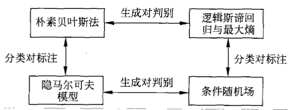

# 统计学习方法总结

[TOC]

> 通过本书共学习了10种主要的统计学习方法，其特点概括如下

| 方法 | 适用问题 | 模型特点 | 模型类型 | 学习策略 | 损失函数 | 学习算法 |
| ---- | ---- | ---- | ---- | ---- | ---- | ---- |
| 感知机 | 二分类 | 分离超平面 | 判别 | 极小化误分点到超平面距离 | 误分点到超平面距离 | 随机梯度下降 |
| $k$近邻 | 多分类 回归 | 特征空间， 样本点 | 判别 |      |      |      |
| 朴素贝叶斯 | 多分类 | 特征与类的 联合概率， 条件独立假设 | 生成 | 极大似然估计 极大后验概率估计 | 对数似然损失 | 概率计算， EM算法 |
| 决策树 | 多分类 回归 | 分类树， 回归树 | 判别 | 正则化极大 似然估计 | 对数似然损失 | 特征选择， 树生成， 剪枝 |
| 逻辑回归 与最大熵 | 多分类 | 特征下的类 别条件概率， 对数线性模型 | 判别 | 极大似然估计 正则化极大似然估计 | 逻辑斯谛损失 | 改进的迭代尺度法 梯度下降 拟牛顿法 |
| 支持向量机 | 二分类 | 分离超平面， 核技巧 | 判别 | 极小化正则化合页损失 软间隔最大化 | 合页损失 | 序列最小最优算法（SMO） |
| 提升方法 | 二分类 | 弱分类器 线性组合 | 判别 | 极小化加法模型 的指数损失 | 指数损失 | 前向分步加法算法 |
| EM算法 | 概率模型 参数估计 | 含隐变量 概率模型 |      | 极大似然估计 极大后验概率估计 | 对数似然损失 | 迭代算法 |
| 隐马尔可夫 | 标注 | 观测与状态 序列联合概率 | 生成 | 极大似然估计 极大后验概率估计 | 对数似然损失 | 概率计算 EM算法 |
| 条件随机场 | 标注 | 状态下的观测 序列条件概率， 对数线性模型 | 判别 | 极大似然估计 正则化极大似然估计 | 对数似然损失 | 改进的迭代尺度法 梯度下降 拟牛顿法 |

#### 1. 适用问题

- 分类问题：从实例的特征向量到类标记的预测问题；
- 标注问题：是从观测序列到标记序列（或状态序列）的预测问题；分类问题是标记问题的特殊情况；
- 分类问题可能预测结果是二类或多类，而标注问题可能的预测结果是所有的标记序列，数目是<u>*指数级*</u>的；
- **分类方法**：感知机、$k$近邻、朴素贝叶斯、决策树、逻辑回归与最大熵模型、支持向量机、提升方法；
  - 原始的感知机、支持向量机以及提升方法是针对二分类的，可以扩展到多类分类；
- **标注方法**：隐马尔可夫模型、条件随机场；
- EM算法是含有隐变量的概率模型的一般学习算法，可以用于<u>*生成模型的非监督学习*</u>；
- 感知机、$k$近邻、朴素贝叶斯、决策树是<u>*简单的分类方法*</u>，具有模型直观、方法简单、容易实现的特点；
- 逻辑回归与最大熵模型、支持向量机、提升方法是<u>*更复杂但更有效的分类方法*</u>，往往分类准确率更高；
- 隐马尔可夫模型、条件随机场是<u>*主要的标注方法*</u>，但条件随机场的准确率更高；

#### 2. 模型

- 分类问题和标注问题的预测模型都可以认为是表示从输入空间到输出空间的映射；写成条件概率形式$P(Y|X)$或决策函数的形式$Y=f(x)$，前者表示输入条件下输出的概率模型，后者表示输入到输出的非概率模型；
- 朴素贝叶斯、隐马尔可夫模型是<u>*概率模型*</u>；
- 感知机、$k$近邻、支持向量机、提升方法是<u>*非概率模型*</u>；
- 决策树、逻辑回归与最大熵模型、条件随机场既可以看作是<u>*概率模型*</u>，也可以看作是<u>*非概率模型*</u>；

- **判别模型**：<u>*直接学习*</u>条件概率分布或决策函数的方法：
  - 感知机、$k$近邻、决策树、逻辑回归与最大熵模型、支持向量机、提升方法、条件随机场；
- **生成模型**：<u>*首先学习联合概率*</u>分布$P(X,Y)$，从而求得条件概率分布的方法：
  - 朴素贝叶斯、隐马尔可夫模型；
- 可以用非监督学习的方法学习生成模型，具体地EM算法可以学习朴素贝叶斯模型以及隐马尔可夫模型；

- 决策树是定义在<u>*一般的特征空间*</u>上的，可以含有连续变量或离散变量；
- 感知机、支持向量机、$k$近邻法的特征空间是<u>*欧氏空间*</u>（更一般地，是<u>*希尔伯特空间*</u>）；
- 提升方法的模型是弱分类器的线性组合，<u>*弱分类器的特征空间*</u>就是提升方法模型的特征空间；

- **线性模型**：感知机；
- **对数线性模型**：逻辑回归与最大熵模型、条件随机场；
- **非线性模型**：$k$近邻法、决策树、支持向量机（包含核函数）、提升方法；

#### 3. 学习策略

- 二分类监督学习中，各个方法对应的损失函数如下：

  - 支持向量机 --> **合页损失函数**
    $$
    [1-yf(x)]_+
    $$

  - 逻辑回归与最大熵模型 --> **逻辑斯谛损失函数**
    $$
    \log[1+\exp(-yf(x))]
    $$

  - 提升方法 --> **指数损失函数**
    $$
    \exp(-yf(x))
    $$

- 3种损失函数都是<u>*0-1损失函数的上界*</u>，具有相似的形状；因此可以认为这三种方法使用不同的**代理损失函数**（surrogate loss function）表示分类损失，定义经验风险或结构风险函数，实现二分类任务；

- **学习策略**：优化以下结构风险函数

$$
\min\limits_{f\in \mathcal{H}}\frac{1}{N}\sum_{i=1}^{N}L(y_i,f(x_i))+\lambda J(f)
$$

​	其中，第1项是经验风险（经验损失），第2项是正则化项，$L(y_i,f(x_i))$为损失函数，$J(f)$为模型的复杂度，$\lambda\geq 0$是系数；

- 关于正则化：
  - 支持向量机 --> $L_2$范数表示模型复杂度；
  - 逻辑回归与最大熵模型 --> 原始模型没有正则化项，可以加上$L_2$范数；
  - 提升方法 --> 没有明显正则化项，通过**早停止**（early stopping）方法达到正则化效果；

- 二类分类问题可以扩展到多类分类问题以及标注问题，如<u>*标注问题的条件随机场*</u>看作是<u>*分类问题的最大熵模型*</u>的推广；

- **概率模型学习**：形式化为<u>*极大似然估计*</u>或者<u>*贝叶斯估计的极大后验概率估计*</u>，学习策略就是<u>*极小化对数似然损失*</u>或<u>*极小化正则化的对数似然损失*</u>

$$
-\log P(y|x)
$$

​	在极大后验概率估计时，正则化项是**先验概率的负对数**；

- 各种模型的策略归纳如下：
  - 决策树 --> 正则化的极大似然估计（对数似然损失 + 决策树的复杂度）；
  - 逻辑回归与最大熵模型、条件随机场 --> 极大似然估计（或正则化的极大似然估计），又或者看成极小化逻辑斯谛损失（或正则化的逻辑斯谛损失）；
  - 朴素贝叶斯、隐马尔可夫模型的<u>*非监督学习*</u> --> 极大似然估计或极大后验概率估计，这时模型中含有隐变量；

#### 4. 学习算法

- 统计学习问题有了具体形式后，就变成**最优化问题**；
- 最优化问题比较简单，解析解存在，最优价可以由公式直接计算；但多数情况下，最优化问题没有解析解，需要用<u>*数值计算法*</u>或<u>*启发式方法*</u>求解；

- 各个模型的算法归纳如下：
  - 朴素贝叶斯、隐马尔可夫模型的<u>*监督学习*</u> --> 由概率公式直接计算，最优解是极大似然估计值；
  - 感知机、逻辑回归与最大熵模型、条件随机场 --> 梯度下降法、拟牛顿法（都是一般的无约束最优化问题的解法）；
  - 支持向量机 --> 解凸二次规划的对偶问题，有序列最小最优化算法（SMO）等；
  - 决策树 --> 基于启发式算法的典型例子，特征选择、生成、剪枝时启发式地进行正则化的极大似然估计；
  - 提升方法 --> 学习模式是加法模型、损失函数是指数损失函数，启发式地从前向后逐步学习模型，达到逼近优化目标函数的目的；
  - EM算法 --> 迭代的求解含隐变量概率模型参数的方法，收敛性可以保证，但不能保证收敛到全局最优；
- **凸优化问题**：支持向量机学习、逻辑回归与最大熵模型学习、条件随机场学习，全局最优解保证存在；
- 其他学习问题则不是凸优化问题；