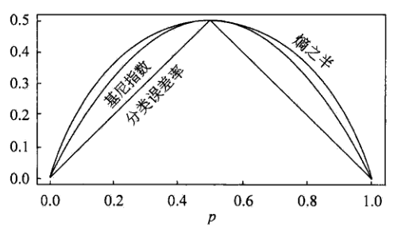

# 决策树

[TOC]

> - 优点：具有可读性，分类速度快；
> - 决策树学习包括3个步骤：特征选择、决策树生成和决策树的修剪；

## 5.1 决策树模型与学习

### 5.1.1 决策树模型

- **决策树**：决策树由**结点**（node）和**有向边**（directed edge）组成；结点有两种类型--**内部结点**（internal node）和**叶结点**（leaf node），内部结点表示一个特征或属性，叶结点表示一个类；
- **决策树分类**：从根结点出发，对实例的某一特征进行测试，根据测试结果将实例分配到子结点，如此递归直到达到叶结点，最后将实例分到叶结点的类中；

### 5.1.2 决策树与if-then规则

- 可以将决策树看成一个if-then规则的集合；
- 根结点到叶结点的每一条路径构建一条**规则**，路径上的内部结点的特征对于规则的**条件**，而叶结点的类对应规则的**结论**；
- 规则集合具有**重要性质**：<u>*互斥并且完备*</u>（每一个实例都只被一条路径或一条规则覆盖）；

### 5.1.3 决策树与条件概率分布

- 决策树还表示给定特征条件下**类的条件概率分布**：将特征空间划分为互不相交的<u>*单元*</u>（cell）或<u>*区域*</u>（region），并将每个单元定义一个类的概率分布就构成一个条件概率分布；
- 各个叶结点（单元）上的条件概率往往偏向于某个类，即属于某一类的概率较大；分类时将改结点的实例强行分到那一类去；

### 5.1.4 决策树学习

- 决策树学习的本质：从训练数据集中归纳出一组分类规则；目的是学习出一个与训练数据矛盾较小的决策树，同时具有很好的泛化能力；
- 决策树的损失函数：**正则化的极大似然函数**；
- 从所有可能决策树种选取最优决策树是NP完全问题，显示中采用启发式方法，进行近似求解，最后得到的决策树是**次最优**（sub-optimal）的；
- **算法流程**--递归选择最优最优特征对特征空间进行划分：
  - 构建<u>*根结点*</u>，将所有训练数据存在根结点；
  - 选择一个<u>*最优特征*</u>，将训练数据分割成子集，使其在当前分类下最优；
  - 如果子集已经能够被基本正确分类，构建<u>*叶结点*</u>，将子集分到叶结点去；
  - 如果还有子集不能被基本正确分类，<u>*再选择新的最优特征*</u>对齐分割，构建相应结点，如此递归<u>*直到所有子集被基本正确分类或者没有合适的特征为止*</u>；
  - 最后每个子集都被分到叶结点上，有了明确的类，<u>*生成一棵决策树*</u>；

- 上述方法生成的决策树很容易发生过拟合现象，需要对已生成的树<u>*自下而上进行剪枝*</u>，将树变得简单（提高泛化能力）：去掉过于细分的叶结点，使其回退到父结点甚至更高的结点，然后将其改为新的叶结点；
- 当特征数量很多时，可以在学习时就进行选择，留下必要的特征；
- 决策树的生成对应于模型的<u>*局部选择*</u>（只考虑局部最优），而决策树的剪枝对应于模型的<u>*全局选择*</u>（考虑全局最优）；

## 5.2 特征选择

### 5.2.1 特征选择问题

- 如果利用一个特征进行分类的结构与随机分类的结果没有很大的差别，则称这个特征是<u>*没有分类能力*</u>的；
- 特征选择的准则是**信息增益**（information gain）或**信息增益比**；
- 特征选择是决定用哪个特征来<u>*划分特征空间*</u>；

### 5.2.2 信息增益

- **熵**（entropy）是表示随机变量不确定性的度量，设$X$是一个取有限个值的离散随机变量，其概率分布为$P(X=x_i)=p_i, i=1,2,\dots,n$，则随机变量$X$的熵定义为：

$$
H(X)=-\sum_{i=1}^{n}p_i\text{log}p_i
$$

​	其中如果$p_i=0​$，定义$0\text{log}0=0​$；式中对数通常以2或者$e​$为底，这时熵的单位分别对应**比特**（bit）和**纳特**（nat）；

- 由定义可知，<u>*熵只依赖于分布*</u>，与$X​$的取值无关，所以也可以记作$H(p)​$；
- 熵越大，随机变量的不确定性就越大，且有

$$
0\leq H(p)\leq \text{log}n
$$

- **条件熵**（conditional entropy）表示在已知随机变量$X$的条件下随机变量$Y$的不确定性，设有随机变量$(X,Y)$，其联合概率分布为$P(X=x_i,Y=y_j)=p_{ij}, i=1,2,\dots,n; j=1,2,\dots,m$，则条件熵$H(Y|X)$定义<u>为$X$给定条件下$Y$的条件概率分布的熵对$X$的数学期望</u>：

$$
H(Y|X)=\sum_{i=1}^{n}p_iH(Y|X=x_i)
$$

​	其中$p_i=P(X=x_i), i=1,2,\dots,n$；

- 当熵和条件熵的概率由数据估计（特别是MLE）时，对应的熵和条件熵称为**经验熵**（empirical entropy）和**经验条件熵**（empirical conditional entropy）；

- **信息增益**表示得知特征$X$的信息而使得类$Y$的信息的不确定性减少的程度；
- 信息增益定义：特征$A$对训练数据集$T$的信息增益$g(T,A)$，定义为集合$T$的经验熵$H(T)$与给定特征$A$条件下$T$的经验条件熵$H(T|A)$之差

$$
g(T,A)=H(T)-H(T|A)
$$

- 一般地，把熵$H(Y)$与条件熵$H(Y|X)$之差成为**互信息**（mutual information）；决策树学习中的信息增益等价于训练数据集中<u>*类与特征的互信息*</u>；

- 决策树应用信息增益准则选择特征，对于数据集$T$而言，信息增益依赖于特征，不同的特征具有不同的信息增益，<u>*信息增益大的特征具有更强的分类能力*</u>；

- **特征选择方法**：对训练数据集$T$（或子集），计算其每个特征的信息增益，比较其大小，选择信息增益大的特征；

- **信息增益计算方法**：

  - 设训练集$T$，样本容量为$|T|$；有$K$个类$C_k, k=1,2,\dots,K$，$|C_k|$表示属于类$C_k$的样本个数，且$\sum_{k=1}^{K}|C_k|=|T|$；设特征$A$有$S$个不同的取值$\{a_1,a_2,\dots,a_S\}$，根据特征$A$的取值将$T$划分为$S$个子集$T_1,T_2,\dots,T_S$，$|T_i|$为样本个数，且$\sum_{i=1}^{S}|T_i|=|T|$；记子集$T_i$中属于类$C_k$的样本集合为$T_{ik}$，即$T_{ik}=T_i\cap C_k$，$|T_{ik}|$为样本个数；
  - 计算数据集$T$的经验熵：

  $$
  H(T)=-\sum_{k=1}^{K}\frac{|C_k|}{|T|}\log_{2}\frac{|C_k|}{|T|}
  $$

  - 计算特征$A$对数据集$T$的经验条件熵：

  $$
  H(T|A)=\sum_{i=1}^{S}\frac{|T_i|}{|T|}H(T_i)=-\sum_{i=1}^{S}\frac{|T_i|}{|T|}\sum_{k=1}^{K}\frac{|T_{ik}|}{|T_i|}\log_{2}\frac{|T_{ik}|}{|T_i|}
  $$

  - 计算信息增益：

  $$
  g(T,A)=H(T)-H(T|A)
  $$

### 5.2.3 信息增益比

- 以信息增益作为划分训练数据集的特征，存在偏向于选择取值较多的特征的问题；
- **信息增益比**（information gain ratio）可以进行校正，是特征选择的另一准则；
- **定义**：特征$A$对训练数据集$T$的信息增益比$g_R(T,A)$定义为其信息增益$g(T,A)$与训练集$T$关于特征$A$的熵$H_A(T)$之比

$$
g_R(T,A)=\frac{g(T,A)}{H_A(T)}
$$

$$
H_A(T)=-\sum_{i=1}^{S}\frac{|T_i|}{|T|}\log_{2}\frac{|T_i|}{|T|}
$$

​	其中$S$是特征$A$取值的个数，同上

## 5.3 决策树生成

### 5.3.1 ID3算法

- 算法核心：在决策树的各个结点上应用信息增益准则选择特征，递归构建决策树；
- **算法流程**（输入训练数据集$T$，特征集$A$，阈值$\epsilon$）：
  - 若$T$中实例属于同一类$C_k$，则为单结点树，并将$C_k$作为该结点的类标记，返回决策树；
  - 若$A= \emptyset$，则为单结点树，并将$T$中实例数最大的类$C_k$作为该结点类标记，返回决策树；
  - 否则，计算$A​$中各个特征对$T​$的==信息增益==，选择信息增益最大的特征$A_g​$；如果$A_g​$的信息增益小于阈值，则为单结点树，并将$T​$中实例数最大的类$C_k​$作为该结点类标记，返回决策树；
  - 否则，根据$A_g$的每一个可能值$a_{gi}$将$T$分割成若干个<u>*非空子集*</u>$T_i$，将$T_i$中实例数最大的类作为标记，构建子结点；
  - 对第$i​$个子结点，以$T_i​$为训练集，以$A-\{A_g\}​$为特征集，递归调用上述步骤，得到子树并返回；

- ID3算法只有树的生成，容易产生过拟合，<u>*ID3相当于用极大似然法进行概率模型的选择*</u>；

### 5.3.2 C4.5生成算法

- C4.5算法对ID3改进，用<u>*信息增益比*</u>来选择特征；
- **算法流程**（输入训练数据集$T$，特征集$A$，阈值$\epsilon$）：
  - 若$T$中实例属于同一类$C_k$，则为单结点树，并将$C_k$作为该结点的类标记，返回决策树；
  - 若$A= \emptyset$，则为单结点树，并将$T$中实例数最大的类$C_k$作为该结点类标记，返回决策树；
  - 否则，计算$A$中各个特征对$T$的==信息增益比==，选择信息增益比最大的特征$A_g$；如果$A_g$的信息增益比小于阈值，则为单结点树，并将$T$中实例数最大的类$C_k$作为该结点类标记，返回决策树；
  - 否则，根据$A_g$的每一个可能值$a_{gi}$将$T$分割成若干个<u>*非空子集*</u>$T_i$，将$T_i$中实例数最大的类作为标记，构建子结点；
  - 对第$i$个子结点，以$T_i$为训练集，以$A-\{A_g\}$为特征集，递归调用上述步骤，得到子树并返回；

## 5.4 决策树的剪枝

- **剪枝**（pruning）：在决策树学习中将已生成的树进行简化的过程；
- 剪枝可以通过极小化决策树整体的<u>*损失函数*</u>或者代价函数实现；
- 设树$DT​$的叶结点个数为$|DT|​$，$t​$是其叶结点，该叶结点有$N_t​$个样本点，其中属于类$C_k​$的样本点有$N_{tk}​$个，$H_t(DT)​$为叶结点$t​$上的经验熵，$\alpha \geq 0​$为参数，则决策树学习的损失函数可以定义为：

$$
C_\alpha(DT)=\sum_{t=1}^{|DT|}N_tH_t(DT)+\alpha|DT|
$$

​	其中经验熵为：
$$
H_t(DT)=-\sum_{k=1}^{K}\frac{N_{tk}}{N_t}\log\frac{N_{tk}}{N_t}
$$

​	将第一项记作：
$$
C(DT)=\sum_{t=1}^{|DT|}N_tH_t(DT)=-\sum_{t=1}^{|DT|}\sum_{k=1}^{K}N_{tk}\log\frac{N_{tk}}{N_t}
$$
​	则损失函数可以进一步写成：
$$
C_\alpha(DT)=C(DT)+\alpha|DT|
$$
​	其中$C(DT)$表示模型对训练数据的预测误差（拟合程度），$|DT|$ 表示模型复杂度，较大的$\alpha$促使选择较简单的模型，$\alpha=0$意味着退化为标准的ID3或者C4.5算法；

- 剪枝就是当$\alpha$确定时，选择损失函数最小的模型，即<u>*损失函数最小的子树*</u>；

- 上述定义损失函数的极小化等价于<u>*正则化的极大似然估计*</u>；

- **树的剪枝算法流程**：
  - 输入生成算法产生的整个决策树$DT$，参数$\alpha$；
  - 计算每个结点的经验熵；
  - 递归地从树的叶结点向上回缩：设一组叶结点回缩到其父结点之前与之后的树分别为$DT_{pre}$和$DT_{aft}$，如果其对应的损失函数值$C_\alpha(DT_{pre}) \geq C_\alpha(DT_{aft})​$，则进行剪枝（父结点变成新叶结点）；
  - 返回上一步，直到不能继续为止，得到损失函数最小的子树；

- 算法在判断剪枝时只考虑了两个数的损失函数的差，计算在局部进行，所以可以用<u>*动态规划*</u>的算法实现；

## 5.5 CART算法

> - **分类与回归树**（classification and regression tree, CART）既可以用于分类也可以用于回归；
> - CART假设决策树是**二叉树**，内部结点特征的取值为“是”与“否”，分别对应左分支和右分支；等价于递归地二分每个特征；
> - CART算法包含两步：
>   - 决策树生成：基于训练数据生成决策树，树要尽量大；
>   - 决策树剪枝：用验证数据集对生成树剪枝并选择最优子树；

### 5.5.1 CART生成

- 对**回归树**用**平方误差**最小化准则，对**分类树**用**基尼指数**（Gini index）最小化准则，进行特征选择，生成二叉树；

#### 1. 回归树生成

- 一个回归树对应着输入空间（特征空间）的<u>*一个划分*</u>以及在划分单元上的<u>*输出值*</u>；
- 假设已将输入空间划分成$M$个单元$R_1,R_2,\dots,R_M$，且每个单元上有一个输出值$c_m$，于是回归树模型可以表示为：

$$
f(x)= \sum_{m=1}^{M}c_m I(x\in R_m)
$$

- 因此可以用平方误差$\sum_{x_i\in R_m}(y_i-f(x_i))^2$来表示回归树对于训练数据的预测误差，用平方误差最小的准则求解每个单元上的最优输出值；单元$R_m$上的最优输出值$\hat{c}_m$是其中所有实例$x_i\in R_m$对于输出值$y_i$的均值：

$$
\hat{c}_m=\text{ave}(y_i|x_i\in R_m)
$$

- **输入空间划分**（启发式方法）：选择第$j$个变量及其取值$s$，作为**切分变量**（splitting variable）和**切分点**（splitting point），并定义两个区域

$$
R_1(j,s)=\{x|x^{(j)}\leq s\}, ~~~~ R_2(j,s)=\{x|x^{(j)}> s\}
$$

​	然后通过求解下列函数寻找最优切分变量和最优切分点：
$$
\min\limits_{j,s}\left[\min\limits_{c_1}\sum_{x_i\in R_1(j,s)}(y_i-c_1)^2+\min\limits_{c_2}\sum_{x_i\in R_2(j,s)}(y_i-c_2)^2\right]
$$

- **最小二乘回归树生成算法**（least squares regression tree）：

  - 输入训练数据集；

  - 在输入空间中递归地将每个区域划分为两个子区域并决定每个子区域上的输出值，构建二叉决策树：

    1. 选择最优切分变量$j$和切分点$s$，求解公式（16）：遍历变量$j$，对固定的切分变量扫描器切分点$s$，选择使得公式（16）达到最小值的对$(j,s)$；

    2. 用选定的$(j,s)$对划分区域并计算出2个对应区域的输出值：
       $$
       \hat{c}_m=\frac{1}{N_m}\sum_{x_i\in R_m(j,s)}y_i, m=1,2
       $$

    3. 继续对两个子区域调用上述两个步骤，直到满足停止条件；

    4. 将输入空间划分成为$M$个区域，生成决策树；

#### 2. 分类树生成

- **分类树**用基尼指数选择最优特征，同时决定该特征的最优二值切分点；
- **基尼指数**：在分类问题中，假设有$K$个类，样本点属于第$C_{k}$类的概率为$p_k$，则概率分布的基尼指数定义为

$$
\text{Gini}(p)=\sum_{k=1}^{K}p_k(1-p_k)=1-\sum_{k=1}^{K}p_k^2
$$

- 对于给定的样本集合$T$，$|T|$表示样本容量，$C_k$表示$T$中属于第$k$类的样本子集，$|C_k|$表示子集的实例数，则其基尼指数为：

$$
\text{Gini}(T)=1-\sum_{k=1}^{K}\left(\frac{|C_k|}{|T|}\right)^2
$$

- 如果样本集合$T$根据特征$A$是否取某可能值$a$被分割成$T_1$和$T_2$两个部分，则在特征$A$的条件下，集合$T$的基尼指数为：

$$
\text{Gini}(T,A)=\frac{|T_1|}{|T|}\text{Gini}(T_1)+\frac{|T_2|}{|T|}\text{Gini}(T_2)
$$

​	其中$\text{Gini}(T)$表示集合$T$的不确定性，而$\text{Gini}(T,A)$表示经特征$A=a$分割后集合$T$的不确定性；

- <u>*基尼指数越大，样本集合的不确定性越大，性质与熵相似*</u>；
- 下图显示二分类问题中基尼指数、熵之半和分类误差率的关系，前两者曲线接近，且都可以近似代表分类误差率：

- **CART决策树生成算法**：

  - 输入数据集$T$，停止计算的条件；

  - 从根结点开始，递归对每个结点进行如下操作，构建二叉决策树：
    1. 设结点的训练数据集为$D$，对于所有可能的特征$A$以及其所有可能的取值$a$，都能把$D$划分为两个部分，并计算全部条件下$D$的基尼指数；
    2. 选择基尼指数最小的特征作及其切分点作为最优特征和最优切分点，从现结点生成两个子结点，将训练数据依照$(j,s)$分配到两个子结点中去；
    3. 对两个子结点递归调用步骤（1,2），直到满足停止条件；
    4. 输出CART决策树；

- **算法停止计算条件**：结点中的样本<u>*个数*</u>小于预定的阈值，或者样本集的<u>*基尼指数*</u>小于预定阈值（样本基本属于同一类），或者<u>*没有更多的特征*</u>；

### 5.5.2 CART剪枝

- 第一步：从生成的决策树$DT_0$的底端开始不断剪枝，直到$DT_0$的根结点，形成一个子树序列$\{DT_0,DT_1,\dots,DT_n\}$；
- 第二步：通过交叉验证在独立的验证集上对子树序列进行测试，从中选择最优子树；

#### 1. 剪枝，形成一个子树序列

- 计算任意子树的损失函数，形式同节5.4，其中预测误差$C(DT)​$换成平方误差或基尼指数：

$$
C_\alpha(DT)=C(DT)+\alpha|DT|
$$

- 剪枝前后损失函数，对于树$DT_0$（算法生成的树）的每个内部结点$t$，有
  - 以$t​$为根结点的树的损失函数为$C_\alpha(DT_t)=C(DT_t)+\alpha|DT_t|​$，就是该结点剪枝前的损失；
  - 以$t​$作为单独叶结点的损失函数为$C_\alpha(t)=C(t)+\alpha​$，就是该结点剪枝后的损失；
  - 显然，对于整个树计算剪枝前后的损失函数和单独计算某个结点剪枝前后的损失函数是等价的；
- 每一个内部结点都有其剪枝临界点$\alpha$：
  - 由于在生成决策树时，只考虑了训练数据（此时$\alpha= 0​$），结点$t​$进行了分类（不是叶结点），因而其不确定性（平方误差或基尼指数）会降低，也就是说在$\alpha= 0​$或者$\alpha​$足够小时不剪枝比剪枝的损失函数小：$C_\alpha(DT_t)<C_\alpha(t)​$；
  - 随着$\alpha$增大，复杂度惩罚项开始起作用，两者的关系会发生变化，当$\alpha$足够大时，剪枝比不剪枝的损失函数小：$C_\alpha(DT_t)>C_\alpha(t)$；
  - 因此一定存在一个临界点使得剪枝前后的损失函数相同，即$\alpha=\frac{C(t)-C(DT_t)}{|DT_t|-1}​$，此时$t​$的节点更少（复杂度更低），因此剪枝$DT_t​$；
  - 综上，当$\alpha$大于等于临界值时，剪枝比不剪枝损失函数更小（或相等），收益更高；
- **性质1**：对于固定的$\alpha$，一定存在使得损失函数$C_\alpha(DT)$最小的子树，表示为$DT_\alpha$；当$\alpha$大时，最优子树$DT_\alpha$偏小，当$\alpha$小时，最优子树偏大；$\alpha=0$时，算法生成的整体树是最优的，当$\alpha\rightarrow\infty$时，根结点组成的单结点树是最优的；
- **性质2**（Breiman已证明）：将$\alpha$从小增大（$[0,\infty)$），剪枝得到的一系列最优子树刚好是嵌套的，即简单的子树从复杂的子树剪枝而来，且$\alpha$各个临界值划分区间内的值都对应同一个最优子树；
- **剪枝**（$\alpha$从小到大）：对于决策树$DT_0$，从最小临界$\alpha$对应的内部结点开始剪枝，也就是自下而上，得到$n$棵最优子树$\{DT_0,DT_1,\dots,DT_n \}​$

#### 2. 交叉验证选择最优子树$DT_\alpha$

- 利用验证集，测试子树序列$\{DT_0,DT_1,\dots,DT_n \}$中各棵子树的平方误差或基尼指数，选择值最小的子树作为最优决策树；

- **CART剪枝算法**：

  1. 输入CART算法生成的决策树$DT_0$；
  2. 自上而下对各个内部结点$t$计算剪枝后整体损失函数较少程度：

  $$
  g(t)=\frac{C(t)-C(DT_t)}{|DT_t|-1}
  $$

  3. 选择$g(t)$值最小的（即得到一个当前临界$\alpha$值）结点剪枝$DT_t$，并对叶结点$t$以多数表决法决定其类，得到子树$DT_1$；

  4. 如果树$DT_1$不是由根结点及其两个叶结点构成的树，回到步骤2（此时树已经改变）递归；否则停止算法，当前子树即为$DT_n$；
  5. 采用交叉验证法在子树序列中选取最优子树$DT_\alpha$；