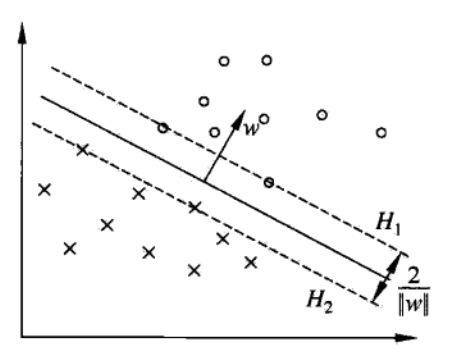

# 支持向量机

[TOC]

> - 支持向量机是一种<u>*二分类模型*</u>，基本模型是定义在特征空间上间隔最大的线性分类器（间隔最大有别于感知机），核技巧使其可以变成非线性分类学；
> - 学习策略是间隔最大化，可形式化为一个求解<u>*凸二次规划问题*</u>，等价于<u>*正则化的合页损失函数的最小化问题*</u>；
> - **线性可分支持向量机**（linear support vector machine in linearly separable case）：训练数据线性可分时，通过**硬间隔最大化**（hard margin maximization）学习的线性分类器；
> - **线性支持向量机**（linear support vector machine）：训练数据近似线性可分时，通过**软间隔最大化**（soft margin maximization）学习的线性分类器；
> - **非线性支持向量机**（non-linear support vector machine）：训练数据线性不可分时，通过**核技巧**（kernel trick）及软间隔最大化学习得到；
> - 当输入空间为欧式空间或离散集合、特征空间为希尔伯特空间时，**核函数**（kernel function）表示将输入从输入空间映射到特征空间得到的特征向量之间的内积；
> - 通过使用核技巧，相当于隐式地在高维特征空间中学习线性支持向量机；

## 7.1 线性可分支持向量机与硬间隔最大化

### 7.1.1 线性可分支持向量机

- 二分类问题中假设输入空间与特征空间是两个不同空间，前者为欧式空间或离散集合，后者为欧式空间或希尔伯特空间；
- 线性可分支持向量机、线性支持向量机假设两个空间元素<u>*一一对应*</u>，并将输入映射为特征空间的特征向量；非线性支持向量机利用一个非线性映射把输入映射为特征向量；（两者都要从输入空间转换到特征空间）；
- 假设有一个特征空间上的训练集$T$，其中实例$x_i$的类标记$y_i\in\{+1,-1\}$，分别表示正例和负例，再假设训练集是线性可分的（第二章感知机内容），那么学习目标是在特征空间中找到一个<u>*分离超平面*</u>，能够将实例分到不同类；
- 分离超平面对应方程$w\cdot x+b=0​$，由法向量$w​$和截距$b​$决定；超平面将特征空间分为两个部分，法向量指向的一侧为正类，另一侧为负类；
- 当训练集线性可分时，感知机通过误分类最小的策略学习超平面，一般<u>*解有无穷多个*</u>；线性可分支持向量机利用间隔最大化求最优超平面，<u>*解是唯一的*</u>；

- **定义**：给定线性可分训练数据集，通过间隔最大化或等价地求解相应的凸二次规划问题学习得到的超平面为$w^*\cdot x+b^*=0​$，以及对应的分类决策函数为

$$
f(x)=\text{sign}(w^*\cdot x+b^*)
$$

​	称为线性可分支持向量机；

### 7.1.2 函数间隔与几何间隔

- 一个点（特征空间）距离超平面的远近可以表示分类预测的确信程度（距离越远，确信度越高）；
- $|w\cdot x+b|$能够表示点$x$距离超平面的远近，而$w\cdot x+b$的符号与类标记$y$的符号是否一致表示分类是否正确，因此可用$y(w\cdot x+b)$表示分类的正确性与确信度；
- **函数间隔**（functional margin）：给定训练集$T$和超平面$(w,b)$，定义超平面关于样本点$(x_i,y_i)$的函数间隔为：

$$
\hat{\gamma_i}=y_i(w\cdot x_i+b)
$$

​	定义超平面关于$T$的函数间隔为超平面关于$T$中所有样本点的函数间隔的最小值：
$$
\hat{\gamma}=\min\limits_{i=1,2,\dots,N}\hat{\gamma_i}
$$

- 但是只有函数间隔还不够，只要成比例地改变$w​$和$b​$，超平面并没有改变，但是函数间隔相应改变；可以对法向量进行约束，使得间隔确定，如$\Vert w\Vert=1​$

- **几何间隔**（geometric margin）：给定训练集$T$和超平面$(w,b)$，定义超平面关于样本点$(x_i,y_i)$的几何间隔为：

$$
\gamma_i=y_i\left(\frac{w}{\Vert w\Vert}\cdot x_i+\frac{b}{\Vert w\Vert}\right)
$$

​	定义超平面关于$T$的几何间隔为超平面关于$T​$中所有样本点的几何间隔的最小值：
$$
\gamma=\min\limits_{i=1,2,\dots,N}\gamma_i
$$
​	其中$\Vert w\Vert​$表示$w​$的$L_2​$范数；

- 几何间隔一般是实例点到超平面的**带符号距离**（signed distance），当样本点被正确分类时，就是实例点到超平面的距离；

- 函数间隔与几何间隔的关系：

$$
\begin{aligned}
\gamma_i &=\frac{\hat{\gamma_i}}{\Vert w\Vert} \\
\gamma &=\frac{\hat{\gamma}}{\Vert w\Vert} \\
\end{aligned}
$$

- 如果$\Vert w\Vert=1$，那么两种间隔相等；当成比例地改变参数$w$和$b$，函数间隔也成比例改变，而几何间隔不变；

### 7.1.3 间隔最大化

- 支持向量机学习的**基本思想**：求解能够正确划分训练集并且几何间隔最大的分离超平面；
- 间隔最大化的**直观解释**：对训练集找到几何间隔最大的超平面意味着以充分大的确信度对训练数据进行分类；即不仅将正负实例点分开，而且对最难分的点（离超平面最近的点）也有足够大的确信度将其分开（可能会对未知实例有很好的分类能力）；

#### 1. 最大间隔分离超平面

- 可以表示成下面的约束优化问题：

$$
\begin{aligned}
&\max\limits_{w,b}\quad \gamma\\
& \begin{array}{r@{\quad}l@{\quad}l}
\text{s.t.} & y_i\left(\frac{w}{\Vert w\Vert}\cdot x_i+\frac{b}{\Vert w\Vert}\right)\geq\gamma, &i=1,2,\dots,N\\
\end{array}
\end{aligned}
$$

​	即希望最大化超平面关于训练数据的几何间隔$\gamma$，约束条件表示每个训练样本点与超平面的几何间隔至少是$\gamma$；

- 考虑几何间隔和函数间隔的关系，可以改写成

$$
\begin{aligned}
&\max\limits_{w,b}\quad \frac{\hat{\gamma}}{\Vert w\Vert}\\
& \begin{array}{r@{\quad}l@{\quad}l}
\text{s.t.} & y_i\left(w\cdot x_i+b\right)\geq\hat{\gamma}, &i=1,2,\dots,N\\
\end{array}
\end{aligned}
$$

​	函数间隔的取值并不影响最优化问题的解（无论$w$和$b$怎么成比例变，对最优化问题的不等式约束没影响，对目标函数优化也没影响），产生了一个<u>*等价的最优化问题*</u>；

- 因此可以取$\hat{\gamma}=1​$，注意到最大化$\frac{\hat{1}}{\Vert w\Vert}​$和最小化$\frac{1}{2}\Vert w\Vert^2​$是等价的，于是得到下面的最优化问题：

$$
\begin{aligned}
&\min\limits_{w,b}\quad \frac{1}{2}\Vert w\Vert^2\\
& \begin{array}{r@{\quad}l@{\quad}l}
\text{s.t.} & y_i\left(w\cdot x_i+b\right)-1\geq 0, &i=1,2,\dots,N\\
\end{array}
\end{aligned}
$$

​	这是一个**凸二次规划**（convex quadratic programming）问题；

> 凸优化问题是指约束最优化问题：
> $$
> \begin{aligned}
> &\min\limits_{w}\quad f(w)\\
> & \begin{array}{r@{\quad}l@{\quad}l}
> \text{s.t.} & g_i(w)\leq 0, &i=1,2,\dots,k\\
> \text{s.t.} & h_j(w) = 0, &j=1,2,\dots,l\\
> \end{array}
> \end{aligned}
> $$
> 其中目标函数$f(x)$和约束函数$g_i(w)$都是$\mathbb{R}^n$上的<u>*连续可微的凸函数*</u>，约束函数$h_j(w)$是$\mathbb{R}^n$上的<u>*仿射函数*</u>（仿射函数满足$f(x)=a\cdot x+b, a\in\mathbb{R}^n, b\in\mathbb{R}, x\in\mathbb{R}^n$）；
>
> 因此当目标函数是二次函数，且约函数是仿射函数时，上述凸最优化问题就称为凸二次规划问题；

- **线性可分支持向量机学习算法-最大间隔法**（maximum margin method）：

  1. **输入**线性可分训练数据集$T$；

  2. 构造并求解约束最优化问题，得到最优解$w^*, b^*$：
     $$
     \begin{aligned}
     &\min\limits_{w,b}\quad \frac{1}{2}\Vert w\Vert^2\\
     & \begin{array}{r@{\quad}l@{\quad}l}
     \text{s.t.} & y_i\left(w\cdot x_i+b\right)-1\geq 0, &i=1,2,\dots,N\\
     \end{array}
     \end{aligned}
     $$

  3. **输出**分离超平面$w^*\cdot x+b^*=0$，以及分类决策函数$f(x)=\text{sign}(w^*\cdot x+b^*)$；

#### 2. 最大间隔分离超平面存在的唯一性

- **定理**（最大间隔分离超平面的存在唯一性）：如果训练数据集线性可分，则将样本点完全正确分开的最大间隔分离超平面<u>*存在且唯一*</u>；

- 由约束最优化问题可以证明：1）存在性；2）唯一性；3）两类点完全正确分开；

#### 3. 支持向量和间隔边界

- 在线性可分的情况下，训练集样本点中与分离超平面距离最近的点的实例称为**支持向量**（support vector）；也即使约束条件等号成立的点：

$$
y_i\left(w\cdot x_i+b\right)-1 = 0
$$

- 对于$y_i=+1$的正例点，支持向量在超平面$H_1:w\cdot x+b=1$上，而对于对于$y_i=-1$的负例点，支持向量在超平面$H_2:w\cdot x+b=-1$上；
- 下图展示了超平面$H_1$和$H_2​$上的点就是支持向量：

- 注意到：超平面$H_1$和$H_2$平行，并且没有实例点落在它们中间；
- 超平面$H_1$和$H_2$之间形成一条长带，分离超平面与它们<u>*平行且位于中央*</u>；
- 长带的带宽（$H_1$和$H_2$之间的距离）称为**间隔**（margin），间隔依赖于法向量$w$，等于$\frac{2}{\Vert w\Vert}$；
- $H_1$和$H_2$称为间隔边界；

- 在决定分离超平面时，<u>*只有支持向量起作用*</u>，而其他实例点并不起作用（改变这些点位置将改变解），所以称为**支持向量机**；
- 支持向量的个数一般很少，所以支持向量机由很少“<u>*重要的*</u>”训练样本确定；

### 7.1.4 学习的对偶算法

- **线性可分支持向量机的对偶算法**：把约束最优化问题作为原始最优化问题，应用拉格朗日对偶性，通过求解对偶问题得到原始问题的最优解；
- 好处：1）对偶问题更容易求解；2）自然引入核函数，推广到非线性情况；
- 定义拉格朗日函数：

$$
L(w,b,\alpha)=\frac{1}{2}\Vert w\Vert^2-\sum_{i=1}^{N}\alpha_iy_i(w\cdot x_i+b)+\sum_{i=1}^{N}\alpha_i
$$

​	其中$\alpha=(\alpha_i,\dots,\alpha_N)^T$是拉格朗日乘子向量；

- 根据对偶性（附录C），原始问题的对偶问题是极大极小问题：

$$
\max\limits_{\alpha}\min\limits_{w,b}L(w,b,\alpha)
$$

- 先求$\min\limits_{w,b}L(w,b,\alpha)​$：

  - 将拉格朗日函数分别对$w,b$求偏导并令其为0：
    $$
    \begin{aligned}
    \nabla_w L(w,b,\alpha)=w-\sum_{i=1}^{N}\alpha_iy_ix_i=0 &\rightarrow w=\sum_{i=1}^{N}\alpha_iy_ix_i \\
    \nabla_b L(w,b,\alpha)=\sum_{i=1}^{N}\alpha_iy_i=0 &\rightarrow \sum_{i=1}^{N}\alpha_iy_i=0\\
    \end{aligned}
    $$

  - 重新代入拉格朗日函数，可得：
    $$
    \begin{aligned}
    L(w,b,\alpha)&=\frac{1}{2}\sum_{i=1}^{N}\sum_{j=1}^{N}\alpha_i\alpha_jy_iy_j(x_i\cdot x_j)-\sum_{i=1}^{N}\alpha_iy_i\left(\left(\sum_{j=1}^{N}\alpha_jy_jx_j\right)\cdot x_i+b\right)+\sum_{i=1}^{N}\alpha_i \\
    &=-\frac{1}{2}\sum_{i=1}^{N}\sum_{j=1}^{N}\alpha_i\alpha_jy_iy_j(x_i\cdot x_j)+\sum_{i=1}^{N}\alpha_i 
    \end{aligned}
    $$

  - 即$\min\limits_{w,b}L(w,b,\alpha)=-\frac{1}{2}\sum_{i=1}^{N}\sum_{j=1}^{N}\alpha_i\alpha_jy_iy_j(x_i\cdot x_j)+\sum_{i=1}^{N}\alpha_i ​$

- 再求$\min\limits_{w,b}L(w,b,\alpha)$对$\alpha$的极大，即是对偶问题

$$
\begin{aligned}
&\max\limits_{\alpha}\quad-\frac{1}{2}\sum_{i=1}^{N}\sum_{j=1}^{N}\alpha_i\alpha_jy_iy_j(x_i\cdot x_j)+\sum_{i=1}^{N}\alpha_i\\
& \begin{array}{r@{\quad}l@{\quad}l}
\text{s.t.} & \quad\sum_{i=1}^{N}\alpha_iy_i=0 &\\
& \quad\alpha_i\geq 0, &i=1,2,\dots,N\\
\end{array}
\end{aligned}
$$

- 将上式由求极大转化为求极小，得到下面等价的对偶最优化问题：

$$
\begin{aligned}
&\min\limits_{\alpha} \quad\frac{1}{2}\sum_{i=1}^{N}\sum_{j=1}^{N}\alpha_i\alpha_jy_iy_j(x_i\cdot x_j)-\sum_{i=1}^{N}\alpha_i\\
& \begin{array}{r@{\quad}l@{\quad}l}
\text{s.t.} & \quad\sum_{i=1}^{N}\alpha_iy_i=0 &\\
& \quad\alpha_i\geq 0, &i=1,2,\dots,N\\
\end{array}
\end{aligned}
$$

- 由附录C定理2可知，存在$w^*,b^*,\alpha^*$使得$w^*,b^*$是原始问题的解，$\alpha^*$是对偶问题的解，求解原始问题可以转换为求解对偶问题；
- 对于线性可分训练数据，假设对偶最优化问题对$\alpha$的解为$\alpha^*=(\alpha_1^*,\dots,\alpha_N^*)^T$，可以由$\alpha^*$求得原始最优化问题对$(w,b)$的解$w^*,b^*$；
- **定理**：设对偶最优化问题解为$\alpha^*=(\alpha_1^*,\dots,\alpha_N^*)^T​$，则存在下标$j​$使得$\alpha_j^*>0​$，并可按下式求得原始最优化问题的解

$$
\begin{aligned}
w^*&=\sum_{i=1}^{N}\alpha_i^*y_ix_i \\
b^*&=y_j -\sum_{i=1}^{N}\alpha_i^*y_i(x_i\cdot x_j)
\end{aligned}
$$

​	此定理可以根据附录C定理3的KKT条件证明，由此而得到的分类决策函数可以写成：
$$
f(x)=\text{sign}\left(\sum_{i=1}^{N}\alpha_i^*y_i(x\cdot x_i)+b^*\right)
$$
​	也就是说，分类决策函数<u>只依赖于输入$x$和训练样本的内积</u>，上式称为**线性可分支持向量机的对偶形式**；

- **线性可分支持向量机的对偶学习算法**：

  1. **输入**线性可分训练集$T$；

  2. 构造并求解约束最优化问题，得到最优解$\alpha^*=(\alpha_1^*,\dots,\alpha_N^*)^T$
     $$
     \begin{aligned}
     &\min\limits_{\alpha} \quad\frac{1}{2}\sum_{i=1}^{N}\sum_{j=1}^{N}\alpha_i\alpha_jy_iy_j(x_i\cdot x_j)-\sum_{i=1}^{N}\alpha_i\\
     & \begin{array}{r@{\quad}l@{\quad}l}
     \text{s.t.} & \quad\sum_{i=1}^{N}\alpha_iy_i=0 &\\
     & \quad\alpha_i\geq 0, &i=1,2,\dots,N\\
     \end{array}
     \end{aligned}
     $$

  3. 计算$w^*=\sum_{i=1}^{N}\alpha_i^*y_ix_i​$，并选择$\alpha^*​$的一个正分量$\alpha_j^*>0​$，计算$b^*=y_j -\sum_{i=1}^{N}\alpha_i^*y_i(x_i\cdot x_j)​$；
  4. 求得分离超平面$w^*\cdot x+b^*=0$，和相应的分类决策函数；

- 由$w^*,b^*​$的计算式可知，其只依赖于训练数据中对应于$\alpha_j^*>0​$的样本点$(x_j,y_j)​$，而其他样本点没有影响，这些实例$x_j\in\mathbb{R}^n​$称为**支持向量**；
- **支持向量定义**：考虑原始最优化问题及对偶最优化问题，将训练集中对应$\alpha_j^*>0$的样本点$(x_j,y_j)$的实例$x_j\in\mathbb{R}^n$称为支持向量；
- 根据这一定义，支持向量一定在间隔边界上（由KKT互补条件可计算得到），与上一节的定义一致；
