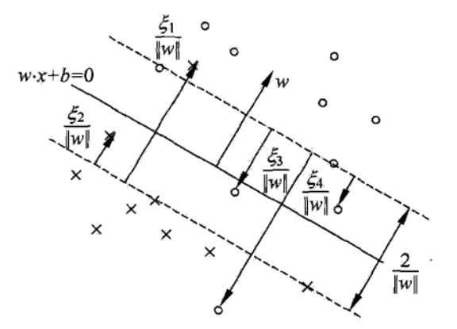

# 支持向量机

[TOC]

## 7.2 线性支持向量机与软间隔最大化

### 7.2.1 线性支持向量机

- 线性可分支持向量机对于线性不可分数据不适用，即上述方法中的<u>*不等式约束并不能都成立*</u>；
- 假设有一个线性不可分的训练数据集$T$，把其中的一些**特异点**（outlier）剔除后，剩下大部分的样本点组成的集合是线性可分的；
- 这些特异点不能满足函数间隔大于等于1的约束条件，为了解决这个问题，对每个样本点$(x_i,y_i)$引入一个**松弛变量**$\xi_i\geq 0$，使得函数间隔加上松弛变量大于等于1，因此约束条件变成：

$$
y_i(w\cdot x_i+b)\geq 1-\xi_i
$$

- 同时，对于每个松弛变量$\xi_i$，支付一个代价$\xi_i$，目标函数变成：

$$
\frac{1}{2}\Vert w\Vert^2+C\sum_{i=1}^{N}\xi_i
$$

​	其中$C$是惩罚参数，由应用问题决定，$C$的值大时对误分类的惩罚增大，$C$的值小时对误分类的惩罚小；因此最小化上述目标函数有两层含义：1）使得$\frac{1}{2}\Vert w\Vert^2$尽量小，即间隔大；2）使得误分类点的个数尽量下，$C$是调和二者的参数；

- 根据上述思路，可以像训练线性可分数据集一样训练线性不可分数据集，称为**软间隔最大化**；

- 线性不可分的线性支持向量机的学习问题变成如下的凸二次规划问题（原始问题）：

$$
\begin{aligned}
&\min\limits_{w,b}\quad \frac{1}{2}\Vert w\Vert^2+C\sum_{i=1}^{N}\xi_i\\
& \begin{array}{r@{\quad}l@{\quad}l}
\text{s.t.} &\quad y_i\left(w\cdot x_i+b\right)-1\geq 0, &i=1,2,\dots,N\\
& \quad \xi_i \geq 0, &i=1,2,\dots,N
\end{array}
\end{aligned}
$$

​	原始问题是一个凸二次规划问题，因而关于$(w,b,\xi)$的解是存在的，且可以证明$w$的<u>*解是惟一的*</u>，但$b$的<u>*解不唯一*</u>，存在于一个区间中；

- 由此训练的解$w^*,b^*$构造的分离超平面和分类决策函数模型为**线性支持向量机**；

- **线性支持向量机的定义**：对于给定线性不可分的训练数据集，通过求解凸二次规划问题，即软间隔最大化问题，得到分离超平面$w^*\cdot x+b^*=0​$，以及对应分类决策函数$f(x)=\text{sign}(w^*\cdot x+b^*)​$，称为线性支持向量机；

### 7.2.2 学习的对偶算法

- 原始最优化问题的拉格朗日函数为：

$$
L(w,b,\xi,\alpha,\mu)=\frac{1}{2}\Vert w\Vert^2+C\sum_{i=1}^{N}\xi_i-\sum_{i=1}^{N}\alpha_i(y_i(w\cdot x+b)-1+\xi_i)-\sum_{i=1}^{N}\mu_i\xi_i
$$

​	其中拉格朗日乘子$\alpha_i\geq0,\mu_i\geq0$；

- 对偶问题是拉格朗日函数的极大极小问题，先求对$w,b,\xi$的极小：

$$
\begin{aligned}
\nabla_w L(w,b,\xi,\alpha,\mu)=w-\sum_{i=1}^{N}\alpha_iy_ix_i=0 &\rightarrow w=\sum_{i=1}^{N}\alpha_iy_ix_i \\
\nabla_b L(w,b,\xi,\alpha,\mu)=-\sum_{i=1}^{N}\alpha_iy_i=0 &\rightarrow \sum_{i=1}^{N}\alpha_iy_i=0\\
\nabla_{\xi_i} L(w,b,\xi,\alpha,\mu)=C-\alpha_i-\mu_i=0 &\rightarrow C-\alpha_i-\mu_i=0\\
\end{aligned}
$$

​	代入拉格朗日函数得：
$$
\min\limits_{w,b,\xi}L(w,b,\xi,\alpha,\mu) = -\frac{1}{2}\sum_{i=1}^{N}\sum_{j=1}^{N}\alpha_i\alpha_jy_iy_j(x_i\cdot x_j)+\sum_{i=1}^{N}\alpha_i
$$

- 再对$\min\limits_{w,b,\xi}L(w,b,\xi,\alpha,\mu)$求$\alpha$极大化，得到对偶问题：

$$
\begin{aligned}
&\max\limits_{\alpha}\quad-\frac{1}{2}\sum_{i=1}^{N}\sum_{j=1}^{N}\alpha_i\alpha_jy_iy_j(x_i\cdot x_j)+\sum_{i=1}^{N}\alpha_i\\
& \begin{array}{r@{\quad}l@{\quad}l}
\text{s.t.} & \quad\sum_{i=1}^{N}\alpha_iy_i=0 &\\
& \quad C-\alpha_i-\mu_i=0, &i=1,2,\dots,N \\
& \quad\alpha_i\geq 0, &i=1,2,\dots,N\\
& \quad\mu_i\geq 0, &i=1,2,\dots,N\\
\end{array}
\end{aligned}
$$

​	其中利用等式约束消去$\mu_i$，只留下变量$\alpha_I$，后面三个约束可以写成：
$$
0\leq \alpha_i\leq C
$$

- 再将上述目标函数由求极大转换为求极小，得到对偶问题；可以通过求解对偶问题得到原始问题的解；

- **定理**：设$\alpha^*=(\alpha_1^*,\dots,\alpha_N^*)^T​$是对偶问题的一个解，如果存在一个分量$0<\alpha_j^*<C​$，则原始问题的解$w^*,b^*​$可由下式求得：

$$
\begin{aligned}
w^* &= \sum_{i=1}^{N}\alpha_i^*y_ix_i \\
b^* &= y_j - \sum_{i=1}^{N}y_i\alpha_i^*(x_i\cdot x_j)
\end{aligned}
$$

​	以上同样可以由附录C定理3的KKT条件证明；

- **线性支持向量机学习算法**：

  1. **输入**训练数据集$T$；

  2. 选择惩罚参数$C>0$，构造求解凸二次规划问题，得到最优解$\alpha^*$：
     $$
     \begin{aligned}
     &\min\limits_{\alpha}\quad \frac{1}{2}\sum_{i=1}^{N}\sum_{j=1}^{N}\alpha_i\alpha_jy_iy_j(x_i\cdot x_j)-\sum_{i=1}^{N}\alpha_i\\
     & \begin{array}{r@{\quad}l@{\quad}l}
     \text{s.t.} & \quad\sum_{i=1}^{N}\alpha_iy_i=0 &\\
     & \quad 0\leq\alpha_i\leq C, &i=1,2,\dots,N \\
     \end{array}
     \end{aligned}
     $$

  3. 计算$w^* = \sum_{i=1}^{N}\alpha_i^*y_ix_i$，选择$\alpha^*$的一个分量$0<\alpha_j^*<C$，计算$b^* = y_j - \sum_{i=1}^{N}y_i\alpha_i^*(x_i\cdot x_j)$；

  4. **输出**分离超平面：
     $$
     w^*\cdot x+b^*=0
     $$
     以及分类决策函数：
     $$
     f(x)=\text{sign}(w^*\cdot x+b^*)
     $$

  - **注意**：在步骤（3）中，对于任意符合条件的$\alpha_j^*$都可以算出$b^*$，由于原始问题对$b$的解并不唯一，所以实际计算时，可以取在<u>*所有符合条件的样本点上的平均值*</u>；

### 7.2.3 支持向量

- 在线性不可分情况下，将对偶问题的解$\alpha^*=(\alpha_1^*,\dots,\alpha_N^*)^T$中对应的$\alpha_j^*>0$的样本点$(x_j,y_j)$的实例$x_j$称为支持向量（软间隔的支持向量）；
- 如下图，这时的支持向量比线性可分时复杂些：分离超平面由实线表示，间隔边界由虚线表示，“$\circ$”表示正例点，“x”表示负例点，实例$x_i$到间隔边界的距离为$\frac{\xi_i}{\Vert x\Vert}$;
- 软间隔的支持向量$x_i$或者<u>*在间隔边界上*</u>，或者<u>*在间隔边界与分离超平面之间*</u>，或者<u>*在分离超平面误分的一侧*</u>：
  - 若$\alpha_i^*<C$，则$\xi_i=0$，支持向量刚刚落在间隔边界上；
  - 若$\alpha_i^*=C$，则$0<\xi_i<1$，则分类正确，支持向量在间隔边界与超平面之间；
  - 若$\alpha_i^*=C$，则$\xi_i=1$，支持向量在分离超平面上；
  - 若$\alpha_i^*=C$，则$\xi_i>1$，支持向量位于分离超平面误分的一侧；

### 7.2.4 合页损失函数

