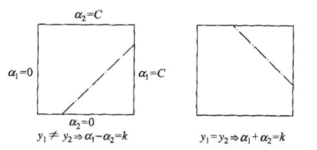

# 支持向量机

[TOC]

## 7.4 序列最小最优化算法

- 当训练样本量很大时，支持向量机学习算法非常低效；
- 面对凸二次规划的对偶问题：

$$
\begin{aligned}
&\min\limits_{\alpha}\quad \frac{1}{2}\sum_{i=1}^{N}\sum_{j=1}^{N}\alpha_i\alpha_jy_iy_jK(x_i, x_j)-\sum_{i=1}^{N}\alpha_i\\
& \begin{array}{r@{\quad}l@{\quad}l}
\text{s.t.} & \quad\sum_{i=1}^{N}\alpha_iy_i=0 &\\
& \quad 0\leq\alpha_i\leq C, &i=1,2,\dots,N \\
\end{array}
\end{aligned}
$$

​	变量是拉格朗日乘子，一个变量$\alpha_i$对于一个样本点，变量总数等于训练样本容量$N$；

- **序列最小最最优**（sequential minimal optimization，SMO）算法是一种启发式算法，思路是：如果所有变量的解都满足此最优化问题的KKT条件，那么这个最优化问题的解就得到了；
  - KKT条件是该最优化问题的充要条件，否则；
  - 选择两个变量，固定其他变量，针对这两个变量构造一个二次规划问题，其解应该更接近原始二次规划问题的解，因为会使得原始二次规划问题的目标函数值变小；
  - 此时子问题可以通过解析方法求解，提高算法速度；
  - 子问题有两个变量，一个是违反KKT条件最严重的一个，另一个由约束条件自动确定，SMO将原问题不断分解为子问题求解；
  - 子问题的两个变量中只有一个是自由变量，假设$\alpha_1,\alpha_2​$为两个变量，其他固定，由等式约束可知$\alpha_1=-y_1\sum_{i=2}^{N}\alpha_iy_i​$，如果$\alpha_2​$确定，那么$\alpha_1​$也随之确定；

### 7.4.1 两个变量二次规划的求解方法

- 假设选择的两个变量是$\alpha_1,\alpha_2$，其他变量固定，于是SMO的最优化问题的**子问题**写成：

$$
\begin{aligned}
&\min\limits_{\alpha_1,\alpha_2}\quad W(\alpha_1,\alpha_2)=\frac{1}{2}K_{11}\alpha_1^2+\frac{1}{2}K_{22}\alpha_2^2+y_1y_2K_{12}\alpha_1\alpha_2-(\alpha_1+\alpha_2)\\
&\quad\quad\quad+y_1\alpha_1\sum_{i=3}^{N}\alpha_iy_iK_{i1}+y_2\alpha_2\sum_{i=3}^{N}\alpha_iy_iK_{i2}\\
& \begin{array}{r@{\quad}l@{\quad}l}
\text{s.t.} & \quad \alpha_1y_1+\alpha_2y_2=-\sum_{i=3}^{N}\alpha_iy_i=\varsigma &\\
& \quad 0\leq\alpha_i\leq C, &i=1,2 \\
\end{array}
\end{aligned}
$$

​	其中$K_{ij}=K(x_i,x_j)​$，$\varsigma​$是常数，目标函数中省略了不含$\alpha_1,\alpha_2​$的常数项；

- 由于只有两个变量$(\alpha_1,\alpha_2)​$，约束可以用二维空间中的图像表示：
  - 不等式约束使得$(\alpha_1,\alpha_2)​$在盒子$[0,C]\times[0,C]​$内；
  - 等式约束使$(\alpha_1,\alpha_2)$在平行于盒子的对角线的直线上；
  - 因此要求的目标函数在一条平行于对角线的线段上的最优值，实质上是<u>*单变量的最优化问题*</u>，不妨设为变量$\alpha_2$的最优化问题；

- 假设初始可行解是$\alpha_1^{old}, \alpha_2^{old}​$，最优化为$\alpha_1^{new}, \alpha_2^{new}​$，并且假设在沿着约束方向未经剪辑时，$\alpha_2​$的最优解为$\alpha_2^{new,unc}​$；
- 由于$\alpha_2^{new}​$需要满足不等式约束，所以其取值范围必须满足：$L\leq\alpha_2^{new}\leq H​$，其中$L,H​$分别是$\alpha_2^{new}​$所在的对角线段断点的届，如果：
  1. $y_1\neq y_2$，则$L=max(0,\alpha_2^{old}-\alpha_1^{old}), H=min(C,C+\alpha_2^{old}-\alpha_1^{old})$；
  2. $y_1= y_2$，则$L=max(0,\alpha_2^{old}+\alpha_1^{old}-C), H=min(C,\alpha_2^{old}+\alpha_1^{old})$；
- 首先求沿着约束方向未经剪辑，即未考虑不等式约束时，$\alpha_2​$的最优解$\alpha_2^{new,unc}​$；然后再求剪辑后的解$\alpha_2^{new}​$，记

$$
g(x)=\sum_{i=1}^{N}\alpha_iy_iK(x_i,x)+b
$$

​	令
$$
E_i=g(x_i)-y_i=\left(\sum_{j=1}^{N}\alpha_jy_jK(x_j,x_i)+b\right)-y_i, i=1,2
$$
​	当$i=1,2$时，$E_i$为函数$g(x)$对输入$x_i$的预测值与真实值之差；

- **定理**（可以通过单变量优化问题一阶导条件证明）：最优化问题（上述子问题）沿着约束方向未经剪辑时的解是

$$
\alpha_2^{new,unc}=\alpha_2^{old}+\frac{y_2(E_1-E_2)}{\eta}
$$

​	其中$\eta=K_{11}+K_{22}-2K_{12}=\Vert \phi(x_1)-\phi(x_2)\Vert^2$，$\phi(x)$是输入空间到特征空间的映射；经剪辑后的解是
$$
\alpha_2^{new}=\left\{
\begin{array}{l@{\quad}l@{\quad}}
H, & \alpha_2^{new,unc}> H \\
\alpha_2^{new,unc}, & L\leq\alpha_2^{new,unc} \leq H \\
L, & \alpha_2^{new,unc} < L\\
\end{array}
\right.
$$

​	由$\alpha_2^{new}​$求得$\alpha_1^{new}​$是
$$
\alpha_1^{new}=\alpha_1^{old}+y_1y_2(\alpha_2^{old}-\alpha_2^{new})
$$

### 7.4.2 变量的选择方法

> SMO算法在每个子问题中选择两个变量优化，其中至少一个变量违反KKT条件

#### 1. 第一个变量选择

- 选择过程称为**外层循环**：在训练集中选取违反KKT条件最严重的样本点，对应的变量作为第一个变量；
- 检验样本点$(x_i,y_i)$是否满足KKT条件：

$$
\begin{aligned}
\alpha_i=0 &\Leftrightarrow y_ig(x_i)\geq1\\
0<\alpha_i<C &\Leftrightarrow y_ig(x_i)=1 \\
\alpha_i=C &\Leftrightarrow y_ig(x_i)\leq 1
\end{aligned}
$$

​	其中$g(x_i)=\sum_{j=1}^{N}\alpha_jy_jK(x_j,x_i)+b$；

- 检验是在$\epsilon​$范围内进行的，首先遍历所有满足$0<\alpha_i<C ​$的样本点（间隔边界上的支持向量点），检验是否满足KKT条件，如果都满足就变量整个训练集，检验他们是否满足KKT条件；

#### 2. 第二个变量选择

- 选择过程称为**内层循环**：选择标准是希望能使$\alpha_2​$有足够大的变化；

- 由于$\alpha_2^{new}​$是依赖于$|E_1-E_2|​$的，为了加快计算速度，简单的做法是选择使得$|E_1-E_2|​$最大的$\alpha_2​$，因为$\alpha_1​$已定，$E_1​$也确定，如果：

  1. $E_1$为正，选择最小的$E_i$作为$E_2$；
  2. $E_1$为负，选择最大的$E_i$作为$E_2$；

  - 为了节省时间，可以将所有$E_i$值预先保存好；

- 特殊情况下如果上述方法选择的$\alpha_2​$不能使目标函数有<u>*足够下降*</u>，采用以下启发式规则继续选择：
  1. 遍历间隔边界上的支持向量点，依次将其对应的变量作为$\alpha_2$试用，直到目标函数由足够的下降；
  2. 如果找不到合适的$\alpha_2$，遍历训练数据集；
  3. 如果找不到合适的$\alpha_2$，放弃第一个变量，通过外层循环寻求新的$\alpha_1$；

#### 3. 计算阈值$b$和差值$E_i​$

- 在每次完成两个变量的优化后，需要重新计算阈值$b$（可通过KKT条件计算）：
  - $0<\alpha_1^{new}<C​$时，$b_1^{new}=-E_1-y_1K_{11}(\alpha_1^{new}-\alpha_1^{old})-y_2K_{21}(\alpha_2^{new}-\alpha_2^{old})+b^{old}​$；
  - $0<\alpha_2^{new}<C$时，$b_2^{new}=-E_2-y_1K_{12}(\alpha_1^{new}-\alpha_1^{old})-y_2K_{22}(\alpha_2^{new}-\alpha_2^{old})+b^{old}$；

- 当$\alpha_1^{new},\alpha_2^{new}$满足$0<\alpha_i^{new}<C$，$b_1^{new}=b_2^{new}$；
- 当$\alpha_1^{new},\alpha_2^{new}​$为0或者$C​$，那么$b_1^{new},b_2^{new}​$以及它们之间的数都是符合KKT条件的阈值，选择它们的终点作为$b^{new}​$；
- $E_i$值的更新要用到$b^{new}$，以及所有支持向量对应的$\alpha_j$：

$$
E_i^{new}=\sum_{S}y_j\alpha_jK(x_i,x_j)+b^{new}-y_i
$$

​	其中$S$是所有支持向量$x_j$的集合；

### 7.4.3 SMO算法

- **SMO算法**：

  1. **输入**训练集$T$，精度$\epsilon$；

  2. 取初值$\alpha^{(0)}=0​$，令$k=0​$；

  3. 选取优化变量$\alpha_1^{(k)},\alpha_2^{(k)}$，解析求解两个变量的最优化问题，得到最优解$\alpha_1^{(k+1)},\alpha_2^{(k+1)}$，更新$\alpha$为$\alpha^{(k+1)}$；

  4. 若在精度范围内满足KKT条件：
     $$
     \begin{aligned}
     & \sum_{i=1}^{N}\alpha_iy_i=0 \\
     & 0\leq\alpha_i\leq C, i=1,2,\dots,N \\
     & y_ig(x_i)=\left\{
     \begin{array}{l@{\quad}l@{\quad}}
     \geq 1, & \{x_i | \alpha_i=0\} \\
     =1, & \{x_i | 0<\alpha_i<C\} \\
     \leq 1, &\{x_i | \alpha_i=C\}\\
     \end{array}
     \right.
     \end{aligned}
     $$
     则进入下一步；否则令$k=k+1$，重复步骤（3）；

  5. **输出**近似解$\hat{\alpha}=\alpha^{(k+1)}​$；

