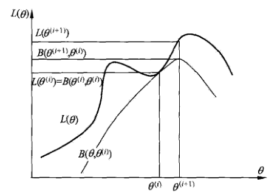

# EM算法及其推广

[TOC]

> EM算法（期望极大算法，Expectation Maximization algorithm）是一种<u>*迭代算法*</u>，用于含有隐变量（hidden variable）的概率模型参数的极大似然估计，或极大后验概率估计

## 9.1 EM算法的引入

### 9.1.1 EM算法

- 一般地，用$Y$表示观测随机变量的数据，$Z$表示隐随机变量的数据，$Y$和$Z$连在一起称为完全数据（complete-data），观测数据$Y$又称为不完全数据（incomplete-data）；
- 假设给定观测数据，其概率分布是$P(Y|\theta)​$，其中$\theta​$是需要估计的模型参数，那么不完全部署的似然函数是$P(Y|\theta)​$，对数似然函数$L(\theta)=\log P(Y|\theta)​$；
- 假设$Y​$和$Z​$的联合概率分布是$P(Y,Z|\theta)​$，那么完全数据的对数似然函数是$\log P(Y,Z|\theta)​$；
- EM算法通过迭代求$L(\theta)=\log P(Y|\theta)$的极大似然估计，每次包含两步：1）E步求期望，2）M步求极大化；

- **EM算法**：

  1. **输入**观测变量数据$Y​$，隐变量数据$Z​$，联合概率分布$P(Y,Z|\theta)​$，条件分布$P(Z|Y,\theta)​$；

  2. 选择参数的初始值$\theta^{(0)}$，开始迭代；

  3. E步：记$\theta^{(i)}​$为第$i​$次迭代参数的估计值，在第$i+1​$次迭代时，计算
     $$
     \begin{aligned}
     Q(\theta,\theta^{(i)})&=\mathbb{E}_Z[\log P(Y,Z|\theta) \vert Y,\theta^{(i)}] \\
     &=\sum_{Z}\log P(Y,Z|\theta)P(Z|Y,\theta^{(i)})
     \end{aligned}
     $$
     其中$P(Z|Y,\theta^{(i)})$是给定观测数据和当前的参数估计下隐变量$Z$的条件概率分布；

  4. M步：求使$Q(\theta,\theta^{(i)})​$极大化的$\theta​$，确定第$i+1​$次迭代参数的估计值$\theta^{(i+1)}​$
     $$
     \theta^{(i+1)}=\arg\max\limits_{\theta}Q(\theta,\theta^{(i)})
     $$

  5. 重复上述两步，直到收敛；

- 函数$Q(\theta,\theta^{(i)})​$是EM算法的核心，称为$Q​$函数（Q function）；
- **Q函数定义**：完全数据的对数似然函数$\log P(Y,Z|\theta)$关于在给定观测数据$Y$和当前参数$\theta^{(i)}$下对未观测数据$Z$额条件概率分布$P(Z|Y,\theta^{(i)})$的期望称为$Q$函数：

$$
Q(\theta,\theta^{(i)})=\mathbb{E}_Z[\log P(Y,Z|\theta) \vert Y,\theta^{(i)}]
$$

- EM算法解释：

  1. 参数的初始值可以任意选择，但是EM算法对初值敏感；

  2. $Q(\theta,\theta^{(i)})​$的第一个变元表示要极大化的参数，第二个变元表示参数的当前估计值，每次迭代实际是求$Q​$函数及其极大化；

  3. 求极大化得到参数的迭代值，可以证明每次迭代可以使<u>*似然函数增大或达到局部极值*</u>；

  4. 给出停止迭代的条件，一般是较小的正数$\varepsilon_1,\varepsilon_2$，满足
     $$
     \Vert \theta^{(i+1)}-\theta^{(i)}\Vert<\varepsilon_1 \quad或\quad \Vert Q(\theta^{(i+1)},\theta^{(i)})-Q(\theta^{(i)},\theta^{(i)})\Vert<\varepsilon_2
     $$
     时停止迭代；

### 9.1.2 EM算法的导出

- 通过近似求解观测数据的对数似然函数的极大化问题导出EM算法；
- 学习的目标是极大化观测数据（不完全数据）对于参数的对数似然函数，即

$$
\begin{aligned}
L(\theta)&=\log P(Y|\theta)=\log \sum_{Z}P(Y,Z|\theta) \\
&=\log\left(\sum_{Z} P(Y|Z,\theta)P(Z|\theta)\right)
\end{aligned}
$$

​	求解困难在于<u>*有未观测数据并有包含和（或积分）的对数*</u>；

- EM算法希望通过迭代逐步近似极大化的$L(\theta)​$，假设在第$i​$步迭代后参数值为$\theta^{(i)}​$，我么希望新估计值$\theta​$能够使$L(\theta)​$增大，即$L(\theta)>L(\theta^{(i)})​$，并逐步达到极大值，考虑两者的差

$$
L(\theta)-L(\theta^{(i)})=\log\left(\sum_{Z} P(Y|Z,\theta)P(Z|\theta)\right)-\log P(Y|\theta^{(i)})
$$

- 利用Jensen不等式（Jensen inequality）得到下界：

$$
\begin{aligned}
L(\theta)-L(\theta^{(i)})&= \log\left(\sum_{Z} P(Z|Y,\theta^{(i)})\frac{P(Y|Z,\theta)P(Z|\theta)}{P(Z|Y,\theta^{(i)})}\right)-\log P(Y|\theta^{(i)})\\
&\geq \sum_{Z} P(Z|Y,\theta^{(i)})\log\frac{P(Y|Z,\theta)P(Z|\theta)}{P(Z|Y,\theta^{(i)})}-\log P(Y|\theta^{(i)}) \\
&= \sum_{Z} P(Z|Y,\theta^{(i)})\log\frac{P(Y|Z,\theta)P(Z|\theta)}{P(Z|Y,\theta^{(i)})P(Y|\theta^{(i)})}
\end{aligned}
$$

> 用到$\log\sum_{j}\lambda_jy_j\geq\sum_{j}\lambda_j\log y_j$，其中$\lambda_j\geq 0, \sum_{j}\lambda_j=1$

- 令

$$
B(\theta,\theta^{(i)})\hat{=}L(\theta^{(i)})+\sum_{Z} P(Z|Y,\theta^{(i)})\log\frac{P(Y|Z,\theta)P(Z|\theta)}{P(Z|Y,\theta^{(i)})P(Y|\theta^{(i)})}
$$

- 那么可以得到

$$
L(\theta)\geq B(\theta,\theta^{(i)})
$$

​	即函数$B(\theta,\theta^{(i)})​$是$L(\theta)​$的下界，而且可以计算得到$L(\theta^{(i)})= B(\theta^{(i)},\theta^{(i)})​$

- 因此，任何可以使$B(\theta,\theta^{(i)})​$增大的$\theta​$都可以使$L(\theta)​$增大，为了可以有尽可能大的增长，选择极大：

$$
\theta^{(i+1)}=\arg\max\limits_{\theta}B(\theta,\theta^{(i)})
$$

- 求$\theta^{(i+1)}$，可以只看关于$\theta$的项：

$$
\begin{aligned}
\theta^{(i+1)}&=\arg\max\limits_{\theta}\left(L(\theta^{(i)})+\sum_{Z} P(Z|Y,\theta^{(i)})\log\frac{P(Y|Z,\theta)P(Z|\theta)}{P(Z|Y,\theta^{(i)})P(Y|\theta^{(i)})}\right)\\
&= \arg\max\limits_{\theta}\left(\sum_{Z} P(Z|Y,\theta^{(i)})\log P(Y|Z,\theta)P(Z|\theta)\right)\\
&= \arg\max\limits_{\theta}\left(\sum_{Z} P(Z|Y,\theta^{(i)})\log P(Y,Z|\theta)\right)\\
&=\arg\max\limits_{\theta}Q(\theta,\theta^{(i)})
\end{aligned}
$$

​	即等价于$Q$函数的极大化，相当于一次迭代；

- EM算法是通过不断求解下界的极大化逼近求解对数似然函数极大化的算法；
- 下图给出EM算法的直观解释，上方曲线为$L(\theta)​$，下方为$B(\theta,\theta^{(i)})​$，：
  - $B(\theta,\theta^{(i)})​$为对数似然函数$L(\theta)​$的下界，两个函数在点$\theta=\theta^{(i)}​$处相等；
  - EM算法找到下一个点$\theta^{(i+1)}​$使得$B(\theta,\theta^{(i)})​$极大化，也使$Q(\theta,\theta^{(i)})​$极大化，由于$L(\theta)\geq B(\theta,\theta^{(i)})​$，因此每次迭代时对数似然函数$L(\theta)​$也是增加；
  - 在点$\theta^{(i+1)}$重新计算$Q$函数，进入下一次迭代；
  - EM算法不能保证找到全局最优值；

### 9.1.3 EM算法在非监督学习中作用

- 有时训练数据只有输入没有对应的输出$\{(x_1,\cdot),(x_2,\cdot),\dots,(x_N,\cdot)\}$，此时学习模型叫非监督学习；
- EM算法可以用于<u>*生成模型的非监督学习*</u>，生成模型由联合概率分布表示$P(X,Y)$，可以认为非监督学习训练数据是联合分布产生的数据，$X$是观测数据，$Y$ 是未观测数据；

## 9.2 EM算法的收敛性

- **定理1**：设$P(Y|\theta)​$是观测数据的似然函数，$\theta^{(i)},i=1,2,\dots​$为EM算法得到的参数估计序列，$P(Y|\theta^{(i)}), i=1,2,\dots​$为对应的似然函数序列，则$P(Y|\theta^{(i)})​$ 是单调递增的，即

$$
P(Y|\theta^{(i+1)})\geq P(Y|\theta^{(i)})
$$

- **定理2**：设$L(\theta)=\log P(Y|\theta)$是观测数据的对数似然函数，$\theta^{(i)},i=1,2,\dots$为EM算法得到的参数估计序列，$L(\theta^{(i)}), i=1,2,\dots$为对应的对数似然函数序列：
  - 如果$P(Y|\theta)$有上界，则$L(\theta^{(i)})=\log P(Y|\theta^{(i)})$收敛到某一值$L^*​$；
  - 在函数$Q(\theta,\theta^{(i)})$与$L(\theta)$满足一定条件下，由EM算法得到的参数估计序列$\theta^{(i)}$的收敛值$\theta^*$是$L(\theta)$的稳定点；

- 关于函数$Q(\theta,\theta^{(i)})​$与$L(\theta)​$的条件大多数情况下式满足的；
- EM算法的收敛性包含对数似然函数序列的收敛性与参数估计序列的收敛性两层意思，前者并不蕴涵后者；
- 定理只能保证参数估计序列收敛到对数似然函数序列的稳定点，不能保证收敛到极大值点；
- 因此应用时，初值的选择f非常重要，常用办法是选取几个不同初值迭代，对得到的估计值比较选择最好的；

## 9.3 EM算法在高斯混合模型学习中的应用

### 9.3.1 高斯混合模型

- **高斯混合模型**（Gaussian mixture model）定义：是指具有如下形式的概率分布模型

$$
P(y|\theta)=\sum_{k=1}^{K}\alpha_k\phi(y|\theta_k)
$$

​	其中$\alpha_k\geq 0$是系数，$\sum_{k=1}^{K}\alpha_k=1$，$\phi(y|\theta_k)$是高斯分布密度函数，$\theta_k=(\mu_k,\sigma_k^2)$，
$$
\phi(y|\theta_k)=\frac{1}{\sqrt{2\pi}\sigma_k}\exp\left(-\frac{(y-\mu_k)^2}{2\sigma_k^2}\right)
$$
​	称为第$k$ 分模型；

- 一般混合模型可以由任意概率分布密度函数组成，这里只讨论最常用的高斯混合模型；

### 9.3.2 高斯混合模型参数估计的EM算法

- 假设观测数据$y_1,y_2,\dots,y_N$由高斯混合模型生成

$$
P(y|\theta)=\sum_{k=1}^{K}\alpha_k\phi(y|\theta_k)
$$

​	其中$\theta=(\alpha_1,\dots,\alpha_K; \theta_1,\dots,\theta_K)$，用EM算法估计模型参数；

#### 1. 明确隐变量，写出完全数据的对数似然函数

- 假设观测数据是这样产生的：首先依靠概率$\alpha_k$选择第$k$个高斯分布模型$\phi(y|\theta_k)$，然后依据该模型的概率分布生成观测数据，此时观测数据$y_j, j=1,2,\dots,N$ 是已知的，而观测数据$y_j$来自第$k$个高斯模型是未知的，用隐变量$\gamma_{jk}, k=1,2,\dots,K$表示，定义为

$$
\gamma_{jk}=\left\{
\begin{aligned}
1, &\quad第j个观测来自第k个模型 \\
0, &\quad否则 
\end{aligned}, j=1,2,\dots,N; k=1,2,\dots,K
\right.
$$

​	因此$\gamma_{jk}$是0-1随机变量；

- 有了观测数据及未观测数据，那么完全数据是

$$
(y_j,\gamma_{j1},\gamma_{j2},\dots,\gamma_{jK}), j=1,2,\dots,N
$$

- 写出完全数据的似然函数：

$$
\begin{aligned}
P(y,\gamma|\theta)&=\prod_{j=1}^{N}P(y_j,\gamma_{j1},\gamma_{j2},\dots,\gamma_{jK}|\theta) \\
&= \prod_{k=1}^{K}\prod_{j=1}^{N}\left[\alpha_k\phi(y_j|\theta_k)\right]^{\gamma_{jk}}\\
&=\prod_{k=1}^{K}\alpha_k^{n_k}\prod_{j=1}^{N}\left[\phi(y_j|\theta_k)\right]^{\gamma_{jk}} \\
&=\prod_{k=1}^{K}\alpha_k^{n_k}\prod_{j=1}^{N}\left[\frac{1}{\sqrt{2\pi}\sigma_k}\exp\left(-\frac{(y_j-\mu_k)^2}{2\sigma_k^2}\right)\right]^{\gamma_{jk}}
\end{aligned}
$$

​	其中$n_k=\sum_{j=1}^{N}\gamma_{jk}, \sum_{k=1}^{N}n_k=N​$；

- 则完全数据的对数似然函数为：

$$
\log P(y,\gamma|\theta)=\sum_{k=1}^{K}\left\{n_k\log\alpha_k+\sum_{j=1}^{N}\gamma_{jk}\left[\log\frac{1}{\sqrt{2\pi}}-\log\sigma_k-\frac{(y_j-\mu_k)^2}{2\sigma_k^2}\right]\right\}
$$

#### 2. EM算法的E步，确定$Q$函数

$$
\begin{aligned}
Q(\theta,\theta^{(i)})&=\mathbb{E}_{\gamma}[P(y,\gamma|\theta)|y,\theta^{(i)}] \\
&=\mathbb{E}_{\gamma}\left\{\sum_{k=1}^{K}\left\{n_k\log\alpha_k+\sum_{j=1}^{N}\gamma_{jk}\left[\log\frac{1}{\sqrt{2\pi}}-\log\sigma_k-\frac{(y_j-\mu_k)^2}{2\sigma_k^2}\right]\right\}\right\} \\
&=\sum_{k=1}^{K}\left\{\sum_{j=1}^{N}\mathbb{E}[\gamma_{jk}]\log\alpha_k+\sum_{j=1}^{N}\mathbb{E}[\gamma_{jk}]\left[\log\frac{1}{\sqrt{2\pi}}-\log\sigma_k-\frac{(y_j-\mu_k)^2}{2\sigma_k^2}\right]\right\}
\end{aligned}
$$

- 其中需要计算$\mathbb{E}[\gamma_{jk}|y,\theta^{(i)}]​$，记作$\hat{\gamma}_{jk}​$：

$$
\begin{aligned}
\hat{\gamma}_{jk} & = \mathbb{E}[\gamma_{jk}|y,\theta^{(i)}] = P(\gamma_{jk}=1|y,\theta^{(i)}) \\
&= \frac{P(\gamma_{jk}=1,y_j|\theta^{(i)})}{\sum_{k=1}^{K}P(\gamma_{jk}=1,y_j|\theta^{(i)})}\\
&= \frac{P(y_j|\gamma_{jk}=1,\theta^{(i)})P(\gamma_{jk}=1|\theta)}{\sum_{k=1}^{K}P(y_j|\gamma_{jk}=1,\theta^{(i)})P(\gamma_{jk}=1|\theta)}\\
&= \frac{\alpha_k\phi(y_j|\theta_{k}^{(i)})}{\sum_{k=1}^{K}\alpha_k\phi(y_j|\theta_{k}^{(i)})}, j=1,2,\dots,N; k=1,2,\dots,K
\end{aligned}
$$

​	$\hat{\gamma}_{jk}$是在当前模型参数下第$j$个观测数据来自第$k$ 分模型的概率，称为分模型$k​$对观测数据$y_j$的**响应度**；

- 用$\hat{\gamma}_{jk}=\mathbb{E}[\gamma_{jk}], \hat{n}_k=\sum_{j=1}^{N}\mathbb{E}[\gamma_{jk}]​$代入得到：

$$
Q(\theta,\theta^{(i)})=\sum_{k=1}^{K}\left\{\hat{n}_k\log\alpha_k+\sum_{j=1}^{N}\hat{\gamma}_{jk}\left[\log\frac{1}{\sqrt{2\pi}}-\log\sigma_k-\frac{(y_j-\mu_k)^2}{2\sigma_k^2}\right]\right\}
$$

#### 3. 确定EM算法的M步

- 求函数$Q(\theta,\theta^{(i)})​$对$\theta​$的极大值，即求新一轮迭代的模型参数：

$$
\theta^{(i+1)}=\arg\max\limits_{\theta}Q(\theta,\theta^{(i)})
$$

​	其中$\theta^{(i+1)}=\{(\hat{\mu}_k,\hat{\sigma}_k^2,\hat{\alpha}_k)|k=1,2,\dots,K\}​$；

- 求$\hat{\mu}_k,\hat{\sigma}_k^2​$ 分别求其偏导并令其为0可得，求$\hat{\alpha}_k​$是在$\sum_{k=1}^{K}\hat{\alpha}_k=1​$条件下求偏导并令其为0得到：

$$
\begin{aligned}
&\hat{\mu}_k =\frac{\sum_{j=1}^{N}\hat{\gamma}_{jk}y_j}{\sum_{j=1}^{N}\hat{\gamma}_{jk}}, \quad k=1,2,\dots,K \\
&\hat{\sigma}_k^2 = \frac{\sum_{j=1}^{N}\hat{\gamma}_{jk}(y_j-\mu_k)^2}{\sum_{j=1}^{N}\hat{\gamma}_{jk}}, \quad k=1,2,\dots,K \\
&\hat{\alpha}_k=\frac{\hat{n}_k}{N}=\frac{\sum_{j=1}^{N}\hat{\gamma}_{jk}}{N}, \quad k=1,2,\dots,K
\end{aligned}
$$

## 9.4 EM算法的推广

> EM算法还可以解释为$F$ 函数（F function）的极大-极大算法（maximization-maximization algorithm），因此可以有若干变形与推广，如广义期望极大（Generalized expectation maximization）算法。

### 9.4.1 $F$函数的极大-极大算法

- **F函数**：假设隐变量数据$Z$的概率分布为$\tilde{P}(Z)$，定义分布$\tilde{P}$与参数$\theta$的函数如下：

$$
F(\tilde{P},\theta)=\mathbb{E}_{\tilde{P}}(\log P(Y,Z|\theta))+H(\tilde{P})
$$

​	称为$F$函数，式中$H(\tilde{P})=-\mathbb{E}_{\tilde{P}}\log \tilde{P}(Z)$是分布的熵；

- 通常假设$P(Y,Z|\theta)​$是$\theta​$的连续函数，因而$F(\tilde{P},\theta)​$是$\tilde{P},\theta​$的连续函数；
- **引理**：对于固定的$\theta​$，存在唯一的分布$\tilde{P}_{\theta}​$极大化$F(\tilde{P},\theta)​$，这时

$$
\tilde{P}_{\theta}(Z)=P(Z|Y,\theta)
$$

​	且$\tilde{P}_{\theta}$随着$\theta$连续变化；

- **引理**：若$\tilde{P}_{\theta}(Z)=P(Z|Y,\theta)$，则

$$
F(\tilde{P},\theta)=\log P(Y|\theta)
$$

- **定理**：设$L(\theta)=\log P(Y|\theta)​$为观测数据的对数似然函数，$\theta^{(i)},i=1,2,\dots​$ 是EM算法得到的参数估计序列，有$F​$函数$F(\tilde{P},\theta)​$：
  - 如果$F(\tilde{P},\theta)$在$\tilde{P}^*$和$\theta^*$有局部极大值，那么$L(\theta)$也在$\theta^*$有局部极大值；
  - 如果$F(\tilde{P},\theta)$在$\tilde{P}^*$和$\theta^*$达到全局最大值，那么$L(\theta)$也在$\theta^*$达到全局最大值；

- **定理**：EM算法的一次迭代可以由$F​$函数的极大-极大算法实现，设$\theta^{(i)}​$为第$i​$次迭代参数的估计值，$\tilde{P}^{(i)}​$为第$i​$次迭代函数的估计，在第$i+1​$次迭代的两步为：
  - 对于固定的$\theta^{(i)}​$，求$\tilde{P}^{(i+1)}​$使$F(\tilde{P},\theta^{(i)})​$极大化；
  - 对于固定的$\tilde{P}^{(i+1)}$，求$\theta^{(i+1)}$使$F(\tilde{P}^{(i+1)},\theta)​$极大化；

### 9.4.2 GEM算法

- **算法1**：
  1. **输入**观测数据，$F​$函数；
  2. 初始化参数$\theta^{(0)}​$，开始迭代；
  3. 在第$i+1​$次迭代，记$\theta^{(i)}​$为第$i​$次迭代参数的估计值，$\tilde{P}^{(i)}​$为第$i​$次迭代函数的估计：
     1. 求$\tilde{P}^{(i+1)}$使$F(\tilde{P},\theta^{(i)})$极大化；
     2. 求$\theta^{(i+1)}​$使$F(\tilde{P}^{(i+1)},\theta)​$极大化；
  4. 重复上述步骤直到收敛；

> 上述算法中有时候求$Q(\theta,\theta^{(i)})​$极大化是很困难的，可以不直接求$\theta^{(i+1)}​$使$Q(\theta,\theta^{(i)})​$极大化，而是找一个$\theta^{(i+1)}​$使得$Q(\theta^{(i+1)},\theta^{(i)})>Q(\theta^{(i)},\theta^{(i)})​$

- **算法2**：

  1. **输入**观测数据，$Q​$函数；

  2. 初始化参数$\theta^{(0)}​$，开始迭代；

  3. 在第$i+1$次迭代，记$\theta^{(i)}$为第$i$次迭代参数的估计值：

     1. 计算
        $$
        \begin{aligned}
        Q(\theta,\theta^{(i)})&=\mathbb{E}_Z[\log P(Y,Z|\theta) \vert Y,\theta^{(i)}] \\
        &=\sum_{Z}\log P(Y,Z|\theta)P(Z|Y,\theta^{(i)})
        \end{aligned}
        $$

     2. 求$\theta^{(i+1)}​$使$Q(\theta^{(i+1)},\theta^{(i)})>Q(\theta^{(i)},\theta^{(i)})​$；

  4. 重复上述步骤直到收敛；

> 当参数$\theta$的维度为$d\geq 2$时，可采用一种特殊的GEM算法，将EM算法的M步分解为$d$次条件极大化，每次只改变参数向量的一个分量，其余不变

- **算法3**：

  1. **输入**观测数据，$Q$函数；

  2. 初始化参数$\theta^{(0)}=(\theta^{(0)}_1,\dots,\theta^{(0)}_d)​$，开始迭代；

  3. 在第$i+1​$次迭代，记$\theta^{(i)}=(\theta^{(i)}_1,\dots,\theta^{(i)}_d)​$为第$i​$次迭代参数的估计值：

     1. 计算
        $$
        \begin{aligned}
        Q(\theta,\theta^{(i)})&=\mathbb{E}_Z[\log P(Y,Z|\theta) \vert Y,\theta^{(i)}] \\
        &=\sum_{Z}\log P(Y,Z|\theta)P(Z|Y,\theta^{(i)})
        \end{aligned}
        $$

     2. 进行$d$条件极大化，保持其他参数不变的情况下求使得$Q(\theta,\theta^{(i)})$极大的$\theta^{(i+1)}_k$，经过$d$次条件极大化，得到$\theta^{(i+1)}=(\theta^{(i+1)}_1,\dots,\theta^{(i+1)}_d)$使得$Q(\theta^{(i+1)},\theta^{(i)})>Q(\theta^{(i)},\theta^{(i)})$；

  4. 重复上述步骤直到收敛；